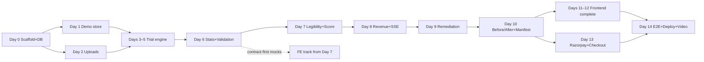

# IMPLEMENTATIONPLAN — AgentAudit

| Field | Value |
|---|---|
| Document | Execution Plan (day-by-day build contract) |
| Version | 1.0 |
| Status | Frozen for build |
| Product | AgentAudit — AI-Buy-Readiness Audit |
| Deadline | **September 3** (submission window) |
| Companion docs | `PRD.md` (why) · `TECHSPEC.md` (engineering) · `SCHEMA.md` (data/API) · `APPFLOW.md` (UX) · `IMPLEMENTATION.md` (overview plan — superseded by this doc where they conflict) |
| Precedence | Tasks, sequencing, gates, and dates: **this doc governs.** Shapes, formulas, copy: TECHSPEC/SCHEMA/APPFLOW govern. |

---

## 0. Errata — reconciliations against the doc set

| # | Location | Defect | Fix (authoritative) |
|---|---|---|---|
| **IP-1** | `IMPLEMENTATION.md` §17 DoD says "3-min video"; `PRD.md` §15 and `APPFLOW.md` §12 specify a 4-minute demo | Contradiction — which artifact is which length? | **Three distinct artifacts, three lengths:** (a) live pitch script = **4:00 hard cap** (APPFLOW §12); (b) rehearsal target = **≤ 4:30** including transitions; (c) submission video = **≤ 3:00** (tight edit of the same recording). Update `IMPLEMENTATION.md` §17: "3-min video" → "submission video ≤ 3:00; live demo 4:00" |
| **IP-2** | `IMPLEMENTATION.md` §11 Day 13 ("Razorpay agent checkout + `make demo-check`") | `demo/manifest.json` **cannot exist on Day 13 as scheduled** — it records the before/after runs, which are only produced on Day 10. `make demo-check` reads the manifest | Manifest recording moved to **Day 10 (T10.4)**, immediately after `run_after`. `make demo-check` implemented Day 12 (T12.1), nightly CI from Day 12 20:00 |
| **IP-3** | `IMPLEMENTATION.md` §11 timeline | Old timeline lacks the endpoints SCHEMA §7.1 added: `POST /api/uploads` (Day 2) and `GET /api/audit/{rerun_id}/delta` (Day 10) | Synced in the day plans below |
| **IP-4** | `IMPLEMENTATION.md` §9 setup | `RAZORPAY_WEBHOOK_SECRET` (TECHSPEC errata E-4) requires creating a webhook in the Razorpay dashboard — a Day 0 prerequisite, not a Day 13 one. Webhook testing also needs a **public URL** (ngrok or early deploy) | Added to Day 0 prerequisites (T0.8, T0.9) |

---

## 1. How to use this plan

1. **Read order on Day 0:** this doc §2–§4 → SCHEMA §12 (constants registry) → TECHSPEC §7–§8 (engine + stats). Everything else is reference-on-demand.
2. **Every task has an ID (`T#.#`)** — reference these in commits and BUILDLOG entries.
3. **Every day ends with a gate** — a pass/fail question. A failed gate triggers the documented response, not improvisation.
4. **No magic numbers.** All constants import from `scoring/config.yaml` or the generated `constants.py` (SCHEMA §12 / SC-13).
5. **`make validate` must be green on `main` from Day 6, 18:00 onward. No exceptions, no overrides.**

### 1.1 Daily operating rhythm (solo or team)

| Time | Action |
|---|---|
| Start | `git pull` → `make validate && make test` (must be green before new work) |
| Midday | Commit working state to `ws/*` branch; BUILDLOG one-liner if a decision was made |
| End | Merge day's branch → tag `v0.N.0` → write **BUILDLOG entry** (5 lines: shipped / broke / spent / decided / tomorrow's risk) → answer the day's gate |

`docs/BUILDLOG.md` is a deliverable, not a diary — it demonstrates engineering process to judges. One entry per day, five lines max.

### 1.2 Team model

Tasks carry owner tags: **[BE]** backend · **[FE]** frontend · **[OPS]** infra · **[ALL]**. If solo, execute strictly in day order — the one parallelization trick that still works solo is **contract-first frontend** (T7.4): the FE builds against mock JSONs copied verbatim from SCHEMA §3.5/§3.6/§3.7 while the BE catches up.

### 1.3 Calendar mapping

Day-numbered plan below. Two mappings:

| | Day 0 | Day 6 | Day 10 | Day 14 | Freeze | Submit |
|---|---|---|---|---|---|---|
| **Comfortable** (start Aug 18) | Aug 18 | Aug 24 | Aug 28 | Sept 1 | Sept 2 | **Sept 3** |
| **Compressed** (start Aug 22) | Aug 22 | Aug 26* | Aug 30* | Sept 1 | Sept 2 | **Sept 3** |

\* compressed via §10 cuts. **Starting after Aug 22: apply §10 with maximum cuts and accept 2 rehearsals instead of 3.** Never compress Day 6 (validation suite) or Day 10 (before/after loop) — they are the project.

---

## 2. Ground Rules

| Rule | Detail |
|---|---|
| Doc precedence | Shapes → SCHEMA · algorithms → TECHSPEC · UX copy → APPFLOW · schedule → this doc |
| Branches | `main` (protected) + `ws/<day>-<slug>` per day; squash-merge nightly; tag `v0.<day>.0` |
| CI | GitHub Actions: PR → lint + unit + golden; nightly (from Day 12) → `make demo-check` |
| Secrets | Only `.env` (gitignored) + platform env vars; `.env.example` committed and always current |
| LLM spend | Tracked in `runs.cost_usd` + BUILDLOG; hard cap $30/run (engine-enforced); **project cap $35** (§8 ledger) |
| Reproducibility | Model versions pinned Day 0 in `engine/models.yaml`; never edited mid-project (TECHSPEC §14) |
| Integrity invariant | No seed/prompt/fixture tuning to inflate deltas — ever (TECHSPEC §14.5). Weak delta → strengthen levers or ship the honest fallback |

---

## 3. Prerequisites (complete before T0.1 — ~2 hours)

| # | Item | Exact action |
|---|---|---|
| P1 | Accounts | GitHub (repo) · OpenRouter (key + **$40 credit**) · Razorpay (test mode account) · Vercel + Railway (free tiers) · ngrok or Cloudflare Tunnel |
| P2 | Toolchain | Python 3.12 · Docker + compose · Node 20 + pnpm · Playwright (`playwright install`) |
| P3 | Razorpay webhook | Dashboard → Settings → Webhooks → **create now** (URL can be ngrok placeholder) → copy **webhook secret** → `.env` as `RAZORPAY_WEBHOOK_SECRET` (IP-4) |
| P4 | Test cards | Save Razorpay test-mode success + decline card numbers for rehearsals |
| P5 | Repo | Create `agentaudit` repo; add collaborators if team |

---

## 4. Workstream Map & Dependencies



Critical path: **Day 0 → 1 → 3 → 4 → 5 → 6 → 9 → 10 → 13 → 14.** Days 2, 7, 8, 11, 12 have slack; Day 2 is the first cut candidate.

---

## 5. Day-by-Day Plan

### Day 0 — Scaffold, DB, Pins, Deploy Skeleton
**Theme:** everything green before any feature. **[OPS] [BE]**

| ID | Task | Files | Est |
|---|---|---|---|
| T0.1 | Repo scaffold per SCHEMA §4 layout | all dirs, README stub | 0.5h |
| T0.2 | FastAPI app + `/healthz` + CORS; pinned requirements | `backend/app/main.py`, `requirements.txt` | 1h |
| T0.3 | Postgres via compose; DDL migration = **SCHEMA §6 verbatim** (incl. `mirror` source, `entity_key`, all CHECKs) | `docker-compose.yml`, `backend/db/init.sql` | 1h |
| T0.4 | `constants.py` mirroring SCHEMA §12; test asserts sync with `scoring/config.yaml` | `backend/app/constants.py` | 1h |
| T0.5 | `engine/models.yaml` with **exact pinned snapshot IDs** (query OpenRouter `/models`); boot-check: 3 bulk + 2 flagship, unique ids | `backend/app/engine/models.yaml` | 1h |
| T0.6 | Makefile: `dev`, `test`, `lint`, `seed-demo` (stub), `validate` (stub) | `Makefile` | 0.5h |
| T0.7 | CI: PR workflow (lint+test); nightly placeholder | `.github/workflows/` | 1h |
| T0.8 | `.env` + `.env.example` with all 7 vars incl. `RAZORPAY_WEBHOOK_SECRET` | root | 0.25h |
| T0.9 | Deploy skeleton: Railway backend (public `/healthz` — this URL is the future webhook target); Vercel FE skeleton | platform configs | 1.5h |
| T0.10 | Init `docs/BUILDLOG.md` | docs | 0.25h |

**Acceptance criteria:**
- [ ] `make dev` runs backend `:8000`, frontend `:3000`, demo-store stub `:8080`
- [ ] `GET /healthz` → 200 **locally and on the deployed Railway URL**
- [ ] `make test` green (trivial suite); CI green on main
- [ ] `models.yaml` passes boot validation
- [ ] DDL applied cleanly to fresh Postgres twice (idempotent)

**Gate G0:** deploy + healthz live? → tag `v0.1.0`. Fail → fix before sleeping; nothing else starts.

---

### Day 1 — Demo Store (the demo's foundation)
**Theme:** the controlled 40-product world. **[BE]**

| ID | Task | Files | Est |
|---|---|---|---|
| T1.1 | Generator: 40 products, 4 categories, tiers 10/20/10, baseline order `[rich, medium, starved, medium]×10`, intra-tier shuffle seed 42, price ladders (starved at deciles 5–7), invented brands, tier matrix per TECHSPEC §5.2 | `demo-store/generate.py` | 3h |
| T1.2 | Anchors enforced: `sku_007` rich/bottles (modal) · `sku_017` rich/bottles (schema example) · `sku_023` starved/backpacks **position 19** (hero) | in generator | 0.5h |
| T1.3 | Static site: `/catalog.json`, `/p/{sku}` (JSON-LD present for rich/medium, absent for starved), `/img/{sku}.svg` placeholders, `/llms.txt` | `demo-store/` | 1.5h |
| T1.4 | Tests: tier counts; anchor identities+positions; `|ρ(tier, position)| < 0.15`; canonical schema validity (SCHEMA §3.1) | `backend/tests/test_demo_store.py` | 1.5h |
| T1.5 | Demo loader → `catalogs(source='demo')` + `products` rows; `GET /catalog`, `GET /catalog/{sku}` | `backend/app/ing/`*, `app/ingest/demo.py` | 1.5h |

**Acceptance criteria:**
- [ ] `make seed-demo` idempotent; `GET /catalog` returns 40 valid products
- [ ] All tests green, including decorrelation assertion
- [ ] Starved pages visibly render "price on request" in listing context

**Cut if behind:** nothing — this day is load-bearing for everything.
**Gate G1:** demo store tests green? → tag `v0.2.0`.

---

### Day 2 — Upload Ingestion (first slack day)
**Theme:** second ingestion path. **[BE]**

| ID | Task | Files | Est |
|---|---|---|---|
| T2.1 | `POST /api/uploads` (multipart + JSON array); validation E101–E107 per SCHEMA §3.1.4 (min 5 products = E107); warn-strip unknown fields; `tier='unknown'` | `backend/app/ingest/upload.py` | 3h |
| T2.2 | CSV path (RFC 4180, headers per SCHEMA; `structured_data` unsupported → computed Day 7) | same | 1.5h |
| T2.3 | Purge: management command deleting `upload` catalogs > 7 days + descendants | `backend/app/purge.py` | 1h |
| T2.4 | API tests covering every error code + the 38-of-40 partial-valid fixture | `backend/tests/test_uploads.py` | 1.5h |

**Acceptance criteria:**
- [ ] Upload fixture (38 valid / 2 bad rows) → `201 {catalog_id, valid: 38, invalid: [...]}`
- [ ] All of E101–E107 exercised by tests
- [ ] Purge command dry-run output correct

**Cut if behind:** **CSV path (T2.2)** — JSON upload suffices for the demo; CSV becomes post-event. This is the plan's first pre-approved cut.
**Gate G2:** uploads solid? → tag `v0.3.0`.

---

### Day 3 — Trial Engine Core
**Theme:** the measurement instrument. **[BE]** Heaviest backend day.

| ID | Task | Files | Est |
|---|---|---|---|
| T3.1 | 20 persona JSONs — **verbatim from SCHEMA §3.2 data dictionary** (incl. `null_plausible` for P04/P09/P10/P20) | `backend/app/engine/personas/` | 1h |
| T3.2 | Condition matrix: enumerate exactly 640 trials (per SCHEMA §2.2 + flagship `C1-s1`, `tier` column); seed derivations (trial + shuffle, SCHEMA §3.3.3); determinism unit tests | `backend/app/engine/conditions.py` | 2h |
| T3.3 | Prompt builder: null-allowed vs forced variants; numbered listings incl. `"price on request"`; framing substitution | `backend/app/engine/prompts.py` | 1.5h |
| T3.4 | **Author `fixtures/framing_variants.json`** by hand: 10 SKUs, stratified 3 rich / 4 medium / 3 starved, **must include `sku_007` and `sku_023`**; information-equivalent rewrites only (same facts, different emphasis) | `fixtures/framing_variants.json` | 2h |
| T3.5 | OpenRouter async client: per-provider semaphore (10), retries 1s/2s/4s with error feedback, circuit breaker (10 fails → 60 s), cost ledger (token pricing table) | `backend/app/engine/client.py` | 2.5h |
| T3.6 | Parse pipeline + golden files: clean JSON · fenced JSON · trailing prose · invalid SKU → outcomes per TECHSPEC §7.4 | `backend/app/engine/parse.py`, `backend/tests/golden/` | 1.5h |

**Acceptance criteria:**
- [ ] Matrix enumerator yields exactly 640 trials: 400 null-allowed / 240 forced (SCHEMA §22)
- [ ] Same persona+condition → same seed, always (test)
- [ ] Golden parse tests green
- [ ] Smoke: 1 model × 2 personas × `C1-s1` writes valid `trials` rows (~$0.05)

**Gate G3:** smoke trials in DB with correct semantics (choice semantics matrix, SCHEMA §3.3.2)? → tag `v0.4.0`.

---

### Day 4 — Runner, Cache, Partial States
**Theme:** production-grade execution semantics. **[BE]**

| ID | Task | Files | Est |
|---|---|---|---|
| T4.1 | Runner: full-matrix execution; status machine `queued→running→done/partial/failed`; cost-cap abort → `partial` (E203 as SSE event, not HTTP error) | `backend/app/engine/runner.py` | 3h |
| T4.2 | Cache: `response_cache` lookup before every call; `from_cache` flag; miss-path write | `backend/app/engine/cache.py` | 1.5h |
| T4.3 | Flagship tier support (`trials.tier='flagship'`) | runner | 0.5h |
| T4.4 | Integration test: full 640 matrix against **mocked provider fixtures** in < 60 s; partial-on-cost-cap test; cache-hit test (second run ≈ free) | `backend/tests/test_runner.py` | 2.5h |

**Acceptance criteria:**
- [ ] Mocked full run: 640 rows, status `done`, < 60 s
- [ ] Cost-cap fixture → `partial` with correct completed count
- [ ] Identical re-run → 100% `from_cache`, $0 marginal

**Gate G4:** mocked end-to-end green? → tag `v0.5.0`.

---

### Day 5 — First Real Run (`run_before`)
**Theme:** real money, real data. **[BE] [OPS]**

| ID | Task | Files | Est |
|---|---|---|---|
| T5.1 | Execute full 640-trial run on demo store via API (real OpenRouter) | live | 1h |
| T5.2 | Parse-rate report per model; tune retry feedback if any model > 5% failures | `runner.py` | 1.5h |
| T5.3 | Sanity queries: shares exist, nulls exist (expect null-plausible personas highest), `presented_order` lengths = 40 | SQL | 1h |
| T5.4 | Record cost in BUILDLOG; verify against OpenRouter dashboard | — | 0.5h |

**Acceptance criteria:**
- [ ] Run completes ≤ 15 min (expect 2–5 min), ≤ $15 (expect ~$12)
- [ ] Parse failure < 5% per model
- [ ] ≥ 1 null choice exists (coverage signal); P04/P09/P10/P20 visibly null-heavier

**Gate G5 (go/no-go):** run clean? → tag `v0.6.0`, proceed. **Fail →** debug provider issues next morning; Day 6 slips half a day; recover by cutting T2.2 (if not already) and Day 11 polish.

---

### Day 6 — Statistics + Validation Suite 🔒 **uncuttable**
**Theme:** the credibility core. **[BE]**

| ID | Task | Files | Est |
|---|---|---|---|
| T6.1 | `bootstrap.py`: persona-cluster resampling, B=2,000, percentile 95; one shared resample recomputes all metrics (score CI propagates) | `backend/app/stats/bootstrap.py` | 2h |
| T6.2 | `metrics.py` per SCHEMA §2.4 namespace: `hhi_norm[:model]`, `position.*` (capture/lift/p-value/per-slot), `framing.*`, `coverage.f_task` (Wilson), `stability.*`, `share:{sku}` (CI-upper < 1/N rule), `parse_rate:{model}` | `backend/app/stats/metrics.py` | 3.5h |
| T6.3 | Permutation test (10,000 replicates) for position bias | `metrics.py` | 1h |
| T6.4 | **Validation suite V1–V6** (TECHSPEC §8.8): planted monopoly / uniform / 80% slot-1 / disjoint models / A-B swap / 30% null | `backend/app/stats/validation/` | 2.5h |
| T6.5 | `make validate` wired to CI — **green-on-main rule starts now** | Makefile, CI | 0.5h |
| T6.6 | `GET /api/audit/{id}/metrics` reading metrics table; contract test against SCHEMA §3.5 shape | `backend/app/main.py` routes | 1.5h |

**Acceptance criteria:**
- [ ] `make validate` green — all six planted-bias cases recovered
- [ ] `run_before` metrics computed: every headline carries a CI
- [ ] Metrics payload passes SCHEMA §3.5 contract test
- [ ] Sanity: `hhi_norm` in a plausible band; invisible set includes starved SKUs (if not — **investigate before proceeding**; likely prompt or listing bug)

**Gate G6:** validation green? → tag `v0.7.0`. **Fail →** nothing else proceeds. This suite is the product's spine.

---

### Day 7 — Legibility, Score, Report + FE Kickoff
**Theme:** explanation layer; frontend starts parallel. **[BE] [FE]**

| ID | Task | Files | Owner | Est |
|---|---|---|---|---|
| T7.1 | Legibility checklist (weights per TECHSPEC §9.2) + LLM-as-judge (pinned mini model, temp 0, rubric prompt as committed fixture, judge responses cached) | `backend/app/scoring/legibility.py` | BE | 2.5h |
| T7.2 | AgentReady Score: 5 components, weights from config, boot-check sum=1.0 (E402), CI propagation | `backend/app/scoring/score.py` | BE | 1.5h |
| T7.3 | Report endpoint: per-product findings + checklists + remediation list + revenue payload (§3.7) | routes | BE | 2h |
| T7.4 | **Contract-first FE:** copy SCHEMA §3.5/§3.6/§3.7 examples → `frontend/mocks/`; build F1 Setup (source cards, GMV, slider w/ live preview) + F2 Progress skeleton against mock SSE | `frontend/` | FE | 4h |

**Acceptance criteria:**
- [ ] All 40 products have legibility composites; starved tier visibly lowest
- [ ] Score bounds test + weight-config sensitivity test green
- [ ] F1 renders with correct microcopy (APPFLOW §13 verbatim strings)

**Gate G7:** report contract test green? → tag `v0.8.0`.

---

### Day 8 — Revenue Model + SSE + Results Data
**Theme:** rupees and liveness. **[BE] [FE]**

| ID | Task | Files | Owner | Est |
|---|---|---|---|---|
| T8.1 | `revenue/risk_model.py`: labels ([measured]/[assumed]/[input]), slider constants {1,5,10,20}%, CI propagation; **unit test must reproduce the E-2 arithmetic**: GMV ₹8L × 20% × F 25.6% = ₹40,960 | `backend/app/revenue/risk_model.py` | BE | 2h |
| T8.2 | SSE stream: `progress` / `trial` / `complete` events per SCHEMA §8; 15 s heartbeat; polling fallback documented | routes | BE | 2h |
| T8.3 | Run status + ETA endpoint | routes | BE | 1h |
| T8.4 | F3 Results page: three-number strip (labels + caption verbatim) + choice heat map — **now wired to real `run_before` data** | `frontend/` | FE | 3h |

**Acceptance criteria:**
- [ ] Revenue unit test passes exact arithmetic; labels present in payload
- [ ] SSE ticker streams live trials during a smoke run
- [ ] F3 strip shows score 48.0 [44.1–52.3] ± real-run drift, with CIs

**Gate G8:** strip renders real numbers end-to-end? → tag `v0.9.0`.

---

### Day 9 — Remediation Engine + Mirror
**Theme:** the fix layer. **[BE] [FE]**

| ID | Task | Files | Owner | Est |
|---|---|---|---|---|
| T9.1 | Fix classes 1–5 (priority order); LLM rubric rewrites for classes 3–4; diff objects per SCHEMA §3.8 | `backend/app/remediate/fixes.py` | BE | 3h |
| T9.2 | Mirror creation: `catalogs(source='mirror', parent_catalog_id)` + copied/fixed products; `remediations` rows `pending` | `backend/app/remediate/mirror.py` | BE | 1.5h |
| T9.3 | Rerun endpoint: 409 E401 unless all rows `approved`; `runs.parent_run_id` set; type=`rerun` | routes | BE | 1h |
| T9.4 | F5 Review UI: grouped fix queue, side-by-side diff (sku_023 pre-expandable), approval checkbox gate | `frontend/` | FE | 3h |

**Acceptance criteria:**
- [ ] Mirror passes canonical schema validation; `sku_023` diff shows fix classes 1–4
- [ ] Rerun before approval → 409 E401 (tested)
- [ ] Human gate functional in UI

**Gate G9:** mirror + gate work? → tag `v0.10.0`.

---

### Day 10 — Before/After + Manifest 🔒 **uncuttable** (IP-2)
**Theme:** the demo's climax, recorded. **[BE] [FE]**

| ID | Task | Files | Est |
|---|---|---|---|
| T10.1 | Optional **lever probe** (~$2 mini-run: 20 personas × 1 model × C1, schema-only mirror vs schema+copy mirror) → choose mirror composition; if C3 framing deltas already show copy moves shares, skip probe | runner | 1h |
| T10.2 | Approve remediation → execute `run_after`: **640 fresh trials** (every prompt hash changes — SC-3), $10–15, 2–4 min | live | 1h |
| T10.3 | Delta endpoint `GET /api/audit/{rerun_id}/delta` (SCHEMA §3.6): component pairs, ΔF [7.6–15.3], recoverable ₹ [12,100–24,500], `ci_overlap`/`honest_fallback` logic | routes | 2.5h |
| T10.4 | **Record `demo/manifest.json`** (IP-2): run ids, catalog versions, headline metrics + CIs, `demo_check.subset_trial_ids` (30), `models_yaml_sha256` | `demo/manifest.json` | 1h |
| T10.5 | F6 Compare page: delta hero, component bars, per-product table, rupee card, **honest-fallback panel** if overlap | `frontend/` | 3h |

**Acceptance criteria:**
- [ ] `run_after` completes; delta payload contract test green
- [ ] Manifest committed and validates against SCHEMA §5.2
- [ ] Decision recorded in BUILDLOG: **non-overlapping CIs** (proceed with delta hero) **or** overlap (fallback narrative is now the designed demo beat — do not weaken it)

**Gate G10 (major go/no-go):** delta computed + manifest recorded → tag `v0.11.0`. **Fail (no delta at all)** → the run failed; debug engine; if unrecoverable by end of Day 11, demo pivots to single-run audit + checkout (last resort — 20% weaker pitch, still coherent).

---

### Day 11 — Frontend Complete (core pages)
**Theme:** every screen real. **[FE]**

| ID | Task | Est |
|---|---|---|
| T11.1 | F4 Drilldown: checklist, visibility CI + fair-share gap, **agent evidence panel** (3 verbatim trial reasons sampled where the SKU is mentioned/skipped) | 2.5h |
| T11.2 | F3 remaining charts: position curve (chance line), stability matrix (bands), coverage dial (nulls by persona), framing dumbbell, product table (filters, ⚠ invisible) | 3.5h |
| T11.3 | Edge/empty/partial states per APPFLOW §11; global conventions: CI tooltips, citation chips, Indian number formatting, sticky footer | 1.5h |

**Acceptance criteria:**
- [ ] Every displayed number traces to API payload (grep audit: zero hardcoded headline numbers in FE)
- [ ] Keyboard navigation smoke passes; charts colorblind-safe w/ value labels

**Cut if behind:** framing dumbbell chart (metric stays in API/report); coverage dial → number + bar.
**Gate G11:** all routes render real data? → tag `v0.12.0`.

---

### Day 12 — Demo-Check + Onboarding Page + Polish
**Theme:** reproducibility as code. **[BE] [FE]**

| ID | Task | Files | Est |
|---|---|---|---|
| T12.1 | `make demo-check`: re-run the manifest's 30-trial subset; **fail** if any headline metric exits its recorded 95% CI; nightly CI at 20:00 | `backend/scripts/demo_check.py`, CI | 2.5h |
| T12.2 | F8 Onboarding demo page + `POST /webhooks/merchant-onboarded` behavior (entity_key, auto-audit) | `frontend/`, routes | 1.5h |
| T12.3 | Run a **cached rerun smoke** (unchanged catalog → ~100% cache hits, < 60 s) and verify F6 banner copy per SC-3 fix | — | 1h |
| T12.4 | Microcopy pass against APPFLOW §13 verbatim table | `frontend/` | 1h |

**Acceptance criteria:**
- [ ] `make demo-check` green twice consecutively (~$0.15/run)
- [ ] Nightly job scheduled and green
- [ ] F8 curl trigger → auto-audit → toast

**Cut if behind:** F8 page (keep the endpoint; demo it via curl — still lands the background-job story).
**Gate G12:** demo-check stable? → tag `v0.13.0`.

---

### Day 13 — Razorpay + Agent Checkout 🔒 **uncuttable**
**Theme:** the payments proof. **[BE] [FE]**

| ID | Task | Files | Est |
|---|---|---|---|
| T13.1 | Payment Links: paise conversion, `reference_id`, idempotency key `agentaudit:{run_id}:{sku}` | `backend/app/razorpay/links.py` | 1.5h |
| T13.2 | Webhook: HMAC constant-time verify (E501), entity_key extraction per SC-1, dedupe, `payments.captured`, SSE badge push | `backend/app/razorpay/webhooks.py` | 2h |
| T13.3 | Point **production webhook URL** at deployed backend; test with ngrok locally first | dashboard + deploy | 1h |
| T13.4 | Agent checkout runner (fixed persona **P07**; function-calling loop; SSE `agent_step`) + F7 page: console, payment card, trust note, captured banner + confetti | `backend/app/razorpay/agent.py`, `frontend/` | 2.5h |
| T13.5 | MCP server (stdio; 3 tools per SCHEMA §10) | `mcp-server/` | 2h |

**Acceptance criteria:**
- [ ] Live test payment → `payment.captured` badge **< 5 s** on deployed URL
- [ ] Webhook replay is deduped; bad signature → 400 E501
- [ ] Agent never touches a credential (code review assertion)

**Cut if behind:** **T13.5 MCP server first** (the runner alone carries the demo); then confetti.
**Gate G13 (go/no-go):** captured badge live on deployed URL? → tag `v0.14.0`.

---

### Day 14 (Sept 1) — E2E, Deploy, README, Video
**Theme:** ship shape. **[ALL]**

| ID | Task | Est |
|---|---|---|
| T14.1 | `make e2e`: Playwright full path (setup → audit [cached] → remediate → approve → rerun → compare → checkout) green **on the deployed stack** | 2.5h |
| T14.2 | README: overview · research grounding w/ all 5 citations · architecture diagram · quickstart · make targets · **limitations (PRD §19 verbatim spirit)** · production path (onboarding webhook, model-version watch, GMV via Razorpay API) · cost table | 2h |
| T14.3 | Record **submission video ≤ 3:00** (IP-1): 25 s hook → 70 s audit + findings → 55 s fix + delta + rupees → 30 s agent checkout. Record the 4:00 live-script rehearsal in the same session; keep both files | 2h |
| T14.4 | Final BUILDLOG entry + cost ledger close-out; tag `v1.0.0-rc1` | 0.5h |

**Acceptance criteria:**
- [ ] `make e2e` green on deployed URL
- [ ] Video ≤ 3:00, uploaded/linked
- [ ] README complete; repo public
- [ ] All five docs + BUILDLOG committed

---

### Sept 2 — Freeze Day (no new features)
1. **Rehearsals ×3** of the 4:00 script (≤ 4:30 with transitions). Primary path = cached manifest runs; live payment real in test mode.
2. P0 bug fixes only. Any change to engine/stats/remediation code requires re-running `make validate` + `make demo-check` first.
3. Backup: final video re-export; screenshot archive of every page.
4. Assemble submission package (§11).

### Sept 3 — Submit
Submit **early in the window**; verify live URL, video link, and repo access from a logged-out browser. Done.

---

## 6. Testing & CI Gate Summary

| Gate | When | Pass condition | On fail |
|---|---|---|---|
| G0 | Day 0 EOD | healthz live local + deployed | Fix overnight; block all |
| G1–G2 | Day 1–2 EOD | store/upload tests green | Day 2 absorbs |
| G3–G4 | Day 3–4 EOD | matrix + mocked run green | Half-day slip, cut T2.2 |
| G5 | Day 5 EOD | real run ≤ 15 min, ≤ $15, parse < 5% | Debug AM; Day 6 slips ½ day |
| **G6** | **Day 6 EOD** | **V1–V6 green** | **Nothing proceeds. Fix until green** |
| G7–G9 | Day 7–9 EOD | contracts + gates green | Cut T7.4 slack, F8 later |
| **G10** | **Day 10 EOD** | **delta + manifest recorded** | Debug; worst case single-run pivot (documented) |
| G11–G12 | Day 11–12 EOD | pages real; demo-check stable | Cut listed chart/page items |
| **G13** | **Day 13 EOD** | **captured badge < 5 s live** | Escalate: ngrok local fallback for demo |
| G14 | Sept 2 | 3 rehearsals ≤ 4:30 | Rehearse until 2 consecutive clean |

**Standing rule (Day 6 18:00 → submission): `make validate` green on `main`, always. A red validate invalidates every result displayed anywhere.**

---

## 7. Budget Ledger (authoritative tracking)

| Item | Est | Running total |
|---|---|---|
| Day 0–2 scaffolding | $0 | $0 |
| Day 3 smoke | $0.05 | $0.05 |
| Day 5 `run_before` (640 trials) | ~$12 | ~$12 |
| Day 7 LLM-as-judge (40 products, cached) | ~$0.50 | ~$12.55 |
| Day 10 lever probe (optional mini-run) | ~$2 | ~$14.55 |
| Day 10 `run_after` (640 trials) | ~$12 | ~$26.55 |
| Day 12+ demo-check (~$0.15/night × 3) | ~$0.45 | ~$27 |
| Rehearsals (cached manifest) | $0 | ~$27 |
| **Buffer** | $8 | **≤ $35 hard project cap** |

If `run_before` + `run_after` together exceed $27: switch flagship pass off for any future runs and re-check pricing table in the cost ledger.

---

## 8. Risk Register (operationalized from PRD §17)

| Risk | Watch trigger | Response (pre-planned) |
|---|---|---|
| Remediation delta within noise | Day 10 G10 | Honest-fallback narrative is the designed beat — rehearse it, don't hide it |
| Provider parse failures > 5% | Day 5 G5 | Strengthen retry feedback; worst case drop offending model from bulk (stability becomes 2-model; update TECHSPEC §2.3 in same commit) |
| Live API flakiness at demo | Any rehearsal | Cached manifest primary; live is additive; say the CI line |
| Cost overrun | Ledger > $27 | Kill flagship passes; mini-tier only |
| Model version deprecated mid-build | OpenRouter notice | Re-pin in `models.yaml`; manifest records versions; re-run `make demo-check` |
| Webhook can't reach local dev | Day 13 | ngrok for dev; deployed URL is the demo target anyway |
| Scope creep (scraping!) | Any urge | NG-1. It's written down twice. No. |

---

## 9. Solo-Mode Ordering (if no team)

Sequential day order with two parallelisms: FE contract-first from Day 7 (T7.4 mocks), and Day 11 FE work can borrow Day 2's slack (cut T2.2 immediately). Expect 6–8 h/day on backend days, 4–6 h on FE days. If any day exceeds 10 h, invoke the day's cut line — the plan's cuts are pre-approved so you don't negotiate with yourself at midnight.

---

## 10. Compression Playbook (late start)

| Starting late by | Cuts (cumulative, in order) |
|---|---|
| 1 day | T13.5 MCP server · T2.2 CSV path |
| 2 days | + flagship pass (both runs → 600 trials; saves ~$4 and ~40 calls) · F8 page (endpoint stays, curl demo) |
| 3 days | + framing dumbbell + coverage dial charts (metrics remain in API/report) · export FR-17 |
| 4 days | + charts → tables for position/stability · rehearsals 2× not 3× |

**Never cut, at any compression level:** Day 6 validation suite · Day 10 before/after + manifest · Day 13 live payment · the revenue strip · the honesty layer (labels, limitations, fallback panel).

---

## 11. Submission Package (Sept 2 checklist)

- [ ] Repo public: PRD · TECHSPEC · APPFLOW · SCHEMA · IMPLEMENTATIONPLAN · this ordering · BUILDLOG · README
- [ ] `make validate` green (CI badge visible)
- [ ] `make demo-check` green (latest nightly)
- [ ] Live URL (Vercel + Railway) — healthz, full flow walkable
- [ ] Submission video ≤ 3:00 + backup 4:00 rehearsal recording (unlisted)
- [ ] `demo/manifest.json` present with recorded runs
- [ ] Cost ledger in README (≤ $35) with OpenRouter/Razorpay test-mode notes
- [ ] Limitations section intact (PRD §19) — **verify no marketing copy violates claim discipline**
- [ ] Razorpay test payment captured on deployed URL (screenshot archived)

---

## 12. Doc-Sync Action Items (from §0 — apply now, 5 minutes)

1. `IMPLEMENTATION.md` §17: "3-min video" → "submission video ≤ 3:00; live demo 4:00" (IP-1).
2. `IMPLEMENTATION.md` §11 Day 13: remove `make demo-check` → Day 12; manifest recording → Day 10 (IP-2).
3. `IMPLEMENTATION.md` §9: add webhook-secret creation + public-URL prerequisite (IP-4).
4. Confirm `POST /api/uploads` (Day 2) and `GET /api/audit/{rerun_id}/delta` (Day 10) appear in any remaining copies of the old timeline (IP-3).

*End of IMPLEMENTATIONPLAN v1.0. Schedule changes require version bump + BUILDLOG entry referencing affected task IDs.*
````

**Save:** copy the block → `IMPLEMENTATIONPLAN.md` in repo root → commit: `git add IMPLEMENTATIONPLAN.md && git commit -m "docs: implementation plan v1.0"`.

**Action items from §0 (5 minutes):** apply the four IP fixes to `IMPLEMENTATION.md` listed in §12 so the old overview doc doesn't contradict this one — the one that matters most is IP-2, because if you'd followed the old Day-13 manifest schedule, `make demo-check` would have had nothing to read three days before submission.

The doc set is now fully closed and internally consistent: **PRD (why) → TECHSPEC (how it works) → SCHEMA (shapes) → APPFLOW (screens) → IMPLEMENTATIONPLAN (when, in what order, with what gates)**. From here it's code only. The first three code artifacts in dependency order, whenever you're ready: `backend/db/init.sql` + `constants.py` straight from SCHEMA §6/§12 (Day 0, tonight), the demo-store generator with the three anchor SKUs and the decorrelation test (Day 1), or the persona files + framing variants fixture (Day 3's input, and the only hand-authored content left in the project). Say which and I'll write it.