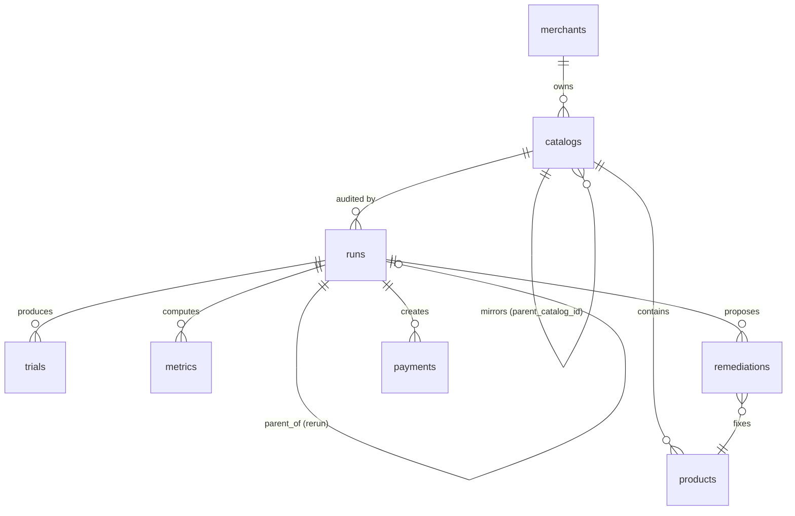

# SCHEMA — AgentAudit

| Field | Value |
|---|---|
| Document | Data & Interface Schema Contract (authoritative) |
| Version | 1.0 |
| Status | Frozen for build |
| Product | AgentAudit — AI-Buy-Readiness Audit |
| Companion docs | `PRD.md` · `TECHSPEC.md` · `APPFLOW.md` · `IMPLEMENTATION.md` |
| Precedence | For data shapes, enums, and constraints: **this doc governs.** Formulas and algorithms remain in TECHSPEC; UX copy in APPFLOW. |

---

## 0. Errata & Clarifications (reconciled against the doc set)

### 0.1 Errata — apply these fixes

| # | Location | Defect | Fix |
|---|---|---|---|
| **SC-1** | TECHSPEC §15 `webhook_events` | Unique index on `(payload->>'id')` can never fire for Razorpay events (their id is nested at `payload.payload.payment.entity.id`) and doesn't exist at all for onboarding payloads | Replace with explicit **`entity_key`** column populated by per-source extractors (§9.3) |
| **SC-2** | TECHSPEC §15 `catalogs.source` | `CHECK (source IN ('demo','upload'))` **rejects mirrored catalogs** — the remediation flow (F5/F6) cannot create them | Add `'mirror'` to the CHECK; add `parent_catalog_id` so a mirror points at its original |
| **SC-3** | TECHSPEC §7.2 ("only products whose copy changed produce new prompt hashes"), FR-16, APPFLOW §11 ("168 new trials") | **Wrong.** Every trial prompt embeds the full 40-product listing, so changing ANY product's copy changes EVERY prompt hash. A remediated re-run is **640 fresh trials** (~$10–15, 2–4 min), not 168 | TECHSPEC §7.2: delete that sentence; FR-16 "< 60 s cached re-run" now scoped to *unchanged-catalog* re-runs only; APPFLOW §11 banner becomes: `Mirror copy changes every listing → 640 new trials ($10–15, 2–4 min)`. Budget impact: 2 full runs ≈ **$25–35 total** — still within target |
| **SC-4** | TECHSPEC §15 `runs` | No link from a rerun to its original run — the F6 delta cannot be computed without fragile joins | Add `parent_run_id UUID NULL REFERENCES runs(id)` |
| **SC-5** | TECHSPEC §16 API table | `POST /api/audit` takes `upload_id`, but **no endpoint creates an upload** | Add `POST /api/uploads` (§7.2); audit request field renamed `catalog_id` |
| **SC-6** | TECHSPEC §15 | Flow-required state has no columns: remediation approval gate, flagship identification, cache accounting | Additive columns: `remediations.status`, `trials.tier`, `trials.from_cache`, `runs.trials_total` |
| **SC-7** | APPFLOW §8 item 3 | "ΔF = 11.4 pts [7.6 – **15.2**]" is inconsistent with its own rupee CI: ₹24,500 / ₹1,60,000 = 15.31 pts | Standardize: **ΔF = 11.4 pts [7.6 – 15.3]** ↔ ₹[12,100 – 24,500] |
| **SC-8** | TECHSPEC §16 | APPFLOW route `/audit/[id]/compare` (F6) has **no backing endpoint** | Add `GET /api/audit/{rerun_id}/delta` (§7.2) |

### 0.2 Clarifications (ambiguities resolved, no prior doc was wrong)

| # | Topic | Resolution |
|---|---|---|
| **C-1** | Two kinds of seeds | **LLM sampling seed** (per persona × condition) and **shuffle-order seed** (per C2 condition, shared across personas/models) are distinct derivations (§3.3.3). TECHSPEC §7.2's single formula applies to both, with different prefixes |
| **C-2** | `choice IS NULL` ambiguity | NULL can mean *agent declined* or *parse failed* — resolved by the semantics matrix (§3.3.2) + a DB CHECK constraint |
| **C-3** | `metrics` UNIQUE(run_id, key) | Composite/per-model/per-SKU metrics require a scoped key namespace: `share:sku_023`, `hhi_norm:gpt4o-mini`, etc. (§2.4) |
| **C-4** | Framing subset for uploaded catalogs | Demo store uses the fixed fixture; uploads auto-select the **10 lowest-legibility products** (the remediation candidates), stratified best-effort by tier |
| **C-5** | Demo-store SKU ↔ position mapping | SKU ids are **fixture-assigned, not position-derived** (positions follow the tier block `[rich, medium, starved, medium]×10`; sku ids cannot equal positions because sku_007 and sku_017 are both rich while sitting in different mod-4 residues — provably incompatible). Anchors fixed in §5.3 |

---

## 1. Conventions

| Convention | Rule |
|---|---|
| Types | `uuid`, `string`, `int`, `float`, `bool`, `ISO-8601 UTC timestamp`, `JSON` |
| Money | INR integer everywhere internally; **paise only at the Razorpay boundary** (`amount_paise = price_inr × 100`) |
| Nullability | Explicit. Absent ≠ null; API bodies reject unknown fields unless stated (uploads warn-and-strip instead, per §3.1.4) |
| Enums | Closed sets. Storing or sending an unlisted value is a bug, not an extension |
| JSON | UTF-8, no NaN/Infinity, keys snake_case |
| Booleans | Real JSON booleans — never `"true"` |
| Hashes | Lowercase hex. `prompt_hash` = sha256, 64 chars |
| Identifier case | SKU ids lowercase; persona ids uppercase (`P07`); condition codes exact-case (`C3-A-s1`) |

---

## 2. Identifier & Enum Registry

### 2.1 ID formats

| Entity | Format | Example |
|---|---|---|
| All DB rows (except where noted) | UUID v4 | `9f3c…` |
| Product SKU | `^sku_[a-z0-9_]{1,29}$` (demo: `sku_001`–`sku_040`) | `sku_023` |
| Persona | `^P(0[1-9]\|1[0-9]\|20)$` | `P07` |
| Condition | `^(C1\|C2)-s[1-3]$` or `^C3-(A\|B)-s[1-2]$` | `C2-s2` |
| Metric key | `^[a-z0-9_.]+(:[a-z0-9_.-]+)?$`, ≤ 100 chars | `share:sku_023` |
| Prompt hash | `^[0-9a-f]{64}$` | `a41f…` |
| Error code | `^E[1-6][0-9]{2}$` | `E401` |

### 2.2 Condition codes (exhaustive)

| Code | Meaning | Null allowed | Count/model (bulk) |
|---|---|---|---|
| `C1-s1`, `C1-s2`, `C1-s3` | baseline order, sample k | yes | 3 × 20 personas |
| `C2-s1`, `C2-s2`, `C2-s3` | seeded shuffle k | yes | 3 × 20 |
| `C3-A-s1`, `C3-A-s2` | original copy, framing subset | **no** | 2 × 20 |
| `C3-B-s1`, `C3-B-s2` | variant copy, framing subset | **no** | 2 × 20 |

Flagship trials reuse `C1-s1` (1 × 20 personas × 2 flagship models); identified by `trials.tier = 'flagship'`, not by condition code.

### 2.3 Model ids (engine ids, not provider strings)

`gpt4o-mini` · `gemini-flash` · `claude-haiku` (bulk) · `gpt4o` · `gemini-pro` (flagship). Provider strings live only in `models.yaml` (§4.1). Every trial stores **both** `model` (engine id) and `model_version` (pinned snapshot).

### 2.4 Metric key namespace (C-3)

| Key pattern | Scopes | `value` | `payload` |
|---|---|---|---|
| `hhi_norm[:{model}]` | `pooled` + each bulk model | normalized HHI | — |
| `position.top3_capture` | pooled | rate + CI | per-slot counts (40) |
| `position.lift` | pooled | lift | — |
| `position.p_value` | pooled | permutation p | — |
| `framing.mean_delta` | pooled | mean Δ + CI | per-product deltas |
| `coverage.f_task` | pooled | rate + Wilson CI | nulls by persona |
| `stability.mean` | pooled | mean cosine + CI | 3×3 matrix |
| `stability.pair.{a}.{b}` | pooled | cosine | — |
| `share:{sku}` | per SKU | share + CI | — |
| `legibility:{sku}` | per SKU | composite | checklist |
| `score` | pooled | score + CI | 5 components |
| `parse_rate:{model}` | per model | rate | — |

### 2.5 Run statuses

`queued` → `running` → {`done` | `partial` | `failed`} (terminal). `partial` = cost cap or circuit breaker; **never rendered as complete anywhere.**

---

## 3. Domain Object Schemas

### 3.1 Product (canonical)

```json
{
  "id": "sku_023",
  "title": "TrailBuddy Daypack 22L",
  "price_inr": 1899,
  "description": "Durable daypack for daily use.",
  "image_url": null,
  "page_url": "https://demo.agentaudit.dev/p/sku_023",
  "tier": "starved",
  "structured_data": {
    "jsonld_present": false,
    "fields_present": [],
    "price_fresh": null,
    "title_quality": 0.1,
    "description_quality": 0.1
  }
}
```

**Field rules:**

| Field | Type | Constraints |
|---|---|---|
| `id` | string | SKU regex; unique per catalog |
| `title` | string | 1–200 chars |
| `price_inr` | int \| null | 1–10,000,000. **True price of the item** — for starved products this is known to the system but absent from `structured_data`, which is why listings render "price on request" |
| `description` | string | ≤ 2,000 chars |
| `image_url`, `page_url` | string \| null | https URLs |
| `tier` | enum | `rich` \| `medium` \| `starved` \| `unknown` (`unknown` = uploaded catalogs) |
| `structured_data.jsonld_present` | bool | — |
| `structured_data.fields_present` | string[] | subset of `name, price, availability, image, brand, aggregateRating` |
| `structured_data.price_fresh` | bool \| null | null when price absent |
| `structured_data.title_quality`, `description_quality` | float [0,1] | demo fixture values; computed via LLM-as-judge for uploads |

**Tier matrix (demo store; normative):** per TECHSPEC §5.2 — rich: 6+ JSON-LD fields, fresh structured price, 60-word description, benefit+spec title · medium: name+price only, stale, ~25 words · starved: no JSON-LD, no structured price, ≤10 words, bare-category title.

#### 3.1.4 Upload validation rules

| Rule | Limit | Code |
|---|---|---|
| Products per upload | **5–500** (min added per C-4/metrics sanity) | E101 / **E107** |
| Payload size | ≤ 5 MB | E102 |
| Required fields | `id`, `title`, `price_inr`, `description` | E103 |
| `price_inr` range | 1–10,000,000 | E104 |
| `description` length | ≤ 2,000 chars | E105 |
| `id` uniqueness | enforced | E106 |
| Unknown fields | warn + strip | — |

**JSON upload:** array of canonical Products (`tier` forced to `unknown`; `structured_data` accepted if provided, else computed by the legibility pass).
**CSV upload:** RFC 4180, UTF-8, headers `id,title,price_inr,description,image_url,page_url` (last two optional); `structured_data` unsupported in CSV (computed).

### 3.2 Persona

```json
{
  "id": "P07",
  "name": "Deal Hunter",
  "profile_summary": "Price-conscious shopper who researches before buying and trusts aggregate value signals.",
  "task": "best value-for-money item in this store",
  "budget_inr": null,
  "null_plausible": false
}
```

**Full data dictionary (all 20 — normative; tasks verbatim from PRD §8.2):**

| ID | Name | profile_summary (one line) | task | budget_inr | null_plausible |
|---|---|---|---|---|---|
| P01 | Budget Student | Watches every rupee; function over frills. | cheapest decent water bottle for daily college use | 300 | false |
| P02 | Gift Buyer | Wants a safe gift that lands well. | gift for a runner friend | 2000 | false |
| P03 | Spec Hound | Compares specs methodically; battery life decides. | best battery-life earbuds | 3500 | false |
| P04 | Eco Buyer | Sustainability-first; walks away rather than compromise. | most sustainably made bottle; price secondary | null | **true** |
| P05 | Commuter | Needs laptop + gym in one bag, daily. | backpack fitting 15" laptop + gym gear | 3000 | false |
| P06 | Premium Seeker | Buys the best; budget is a formality. | best headphones in the store, budget flexible | 15000 | false |
| P07 | Deal Hunter | Researches, trusts value signals. | best value-for-money item in this store | null | false |
| P08 | Urgent Buyer | Speed over perfection, needs it now. | any reasonable water bottle, fastest delivery | 1000 | false |
| P09 | Brand Loyalist | Sticks to recognizable names only. | prefer well-known brands | 5000 | **true** |
| P10 | Minimalist | Plain and understated only. | plain, understated design, nothing flashy | 2500 | **true** |
| P11 | Fitness Newcomer | Wants simple starter gear, no jargon. | starter fitness gear | 1500 | false |
| P12 | Parent | Buys for a 12-year-old; durability first. | durable backpack for a 12-year-old | 1200 | false |
| P13 | Podcast Listener | Comfort over 4h+ sessions decides. | comfortable headphones for 4h+ listening sessions | 4000 | false |
| P14 | Gym Regular | Daily-use, practical, replaceable. | shaker/gym bottle for daily use | 800 | false |
| P15 | Trekker | Day-hike capacity and weight matter. | hydration setup for day hikes | 2000 | false |
| P16 | WFH Professional | Mic quality and all-day comfort. | headphones for long video calls | 5000 | false |
| P17 | Gift-Card Spender | Maximizes value within a fixed card. | spend a ₹1,000 gift card well | 1000 | false |
| P18 | Comparison Shopper | Cross-category value hunter. | single best overall value across all categories | null | false |
| P19 | Trend Follower | Goes with popularity and ratings. | whatever's most popular / best-rated | 3000 | false |
| P20 | Skeptic | Buys only with clear warranty/returns. | only products with clear warranty or return info | 4000 | **true** |

Null-plausible set {P04, P09, P10, P20} is fixed; changing it invalidates the coverage metric's design and requires a doc version bump.

### 3.3 Trial

```json
{
  "id": "uuid",
  "run_id": "uuid",
  "model": "claude-haiku",
  "model_version": "claude-3-5-haiku-20241022",
  "tier": "bulk",
  "persona_id": "P12",
  "condition": "C1-s1",
  "seed": 1836747591,
  "presented_order": ["sku_003", "sku_041_no", "…40 sku ids…"],
  "choice": "sku_023",
  "reason": "The daypack's price couldn't be verified from the listing data, so I chose a backpack with a confirmed price.",
  "latency_ms": 677,
  "prompt_hash": "a41f…(64 hex)",
  "null_allowed": true,
  "parse_ok": true,
  "from_cache": false
}
```

#### 3.3.2 Choice semantics matrix (C-2) — normative

| `parse_ok` | `null_allowed` | `choice` | Meaning | Metric treatment |
|---|---|---|---|---|
| true | true | SKU | valid choice | counted in shares |
| true | true | **NULL** | agent declined ("nothing fits") | counted in F_task numerator |
| true | false | SKU | valid forced choice | counted in C3 shares |
| true | false | NULL | impossible post-validation | must not exist — DB CHECK |
| false | any | NULL | parse failure (after 3 retries) | excluded; counted in `parse_rate:{model}` |

DB enforcement: `CHECK (parse_ok = false OR choice IS NOT NULL OR null_allowed = true)`.

#### 3.3.3 Seed derivations (C-1) — normative

- **LLM sampling seed:** `int(sha256("trial|" + persona_id + "|" + condition_code)[:8], 16) % 2**31` — per persona × condition; passed to the provider where supported, recorded always.
- **Shuffle-order seed (C2 only):** `int(sha256("shuffle|" + condition_code)[:8], 16) % 2**31` — one presented order per `C2-s{k}`, **shared across all personas and models** (position bias is measured over a controlled set of 3 orderings).
- **Prompt hash:** `sha256(prompt_body + "||" + str(seed))` — 64-char hex. Cache key with `model_version`.

### 3.4 Run

```json
{
  "id": "uuid",
  "catalog_id": "uuid",
  "parent_run_id": null,
  "type": "audit",
  "status": "done",
  "models": {
    "bulk": [
      {"id": "gpt4o-mini", "openrouter_id": "openai/gpt-4o-mini", "version": "<pinned>"},
      {"id": "gemini-flash", "openrouter_id": "google/gemini-flash-1.5", "version": "<pinned>"},
      {"id": "claude-haiku", "openrouter_id": "anthropic/claude-3-5-haiku", "version": "<pinned>"}
    ],
    "flagship": [
      {"id": "gpt4o", "openrouter_id": "openai/gpt-4o", "version": "<pinned>"},
      {"id": "gemini-pro", "openrouter_id": "google/gemini-1.5-pro", "version": "<pinned>"}
    ]
  },
  "seeds": {
    "spec_version": 1,
    "trial": "int(sha256('trial|{persona}|{condition}')[:8],16) % 2^31",
    "shuffle": "int(sha256('shuffle|{condition}')[:8],16) % 2^31"
  },
  "cost_usd": 11.87,
  "trials_total": 640,
  "started_at": "2025-08-20T09:14:02Z",
  "completed_at": "2025-08-20T09:17:41Z"
}
```

`models` is a **snapshot** of `models.yaml` at run time — a mid-project version change never corrupts an existing run's reproducibility. A rerun (`type: "rerun"`) must have `parent_run_id` set and reference a `mirror` catalog.

### 3.5 Metrics payload (`GET /api/audit/{id}/metrics`)

```json
{
  "run_id": "uuid",
  "status": "done",
  "partial": false,
  "trials": {"total": 640, "parse_ok": 631, "null_allowed": 400, "forced": 240},
  "hhi_norm": {"value": 0.54, "ci_low": 0.49, "ci_high": 0.59,
    "per_model": {"gpt4o-mini": {"value": 0.51}, "gemini-flash": {"value": 0.57}, "claude-haiku": {"value": 0.55}}},
  "position": {
    "top3_capture": {"value": 0.315, "ci_low": 0.262, "ci_high": 0.371},
    "lift": 4.2,
    "p_value": 0.0004,
    "per_slot": [0.098, 0.081, 0.079, "…40 floats summing to 1.0…"]
  },
  "framing": {
    "mean_delta": {"value": 0.083, "ci_low": 0.051, "ci_high": 0.119},
    "per_product": [{"sku": "sku_017", "share_a": 0.19, "share_b": 0.07, "delta": 0.12}]
  },
  "coverage": {
    "f_task": {"value": 0.256, "ci_low": 0.208, "ci_high": 0.293},
    "nulls_by_persona": [{"persona_id": "P04", "null_rate": 0.71}]
  },
  "stability": {
    "matrix": {"gpt4o-mini|gemini-flash": 0.41, "gpt4o-mini|claude-haiku": 0.52, "gemini-flash|claude-haiku": 0.51},
    "mean": {"value": 0.48, "ci_low": 0.41, "ci_high": 0.55},
    "band": "divergent"
  },
  "invisible_skus": [
    {"sku": "sku_023", "share": {"value": 0.009, "ci_low": 0.0, "ci_high": 0.021}}
  ],
  "score": {
    "value": 48.0, "ci_low": 44.1, "ci_high": 52.3,
    "components": {"visibility": 0.46, "stability": 0.48, "position_indep": 0.20, "coverage": 0.744, "data_completeness": 0.5175}
  },
  "models_meta": [{"id": "gpt4o-mini", "version": "<pinned>", "parse_failure_rate": 0.011}],
  "cost_usd": 11.87,
  "manifest_ref": null
}
```

`manifest_ref` is set only for recorded demo runs (`"demo/manifest.json#runs.before"`). Every CI here uses the persona-cluster bootstrap (B = 2,000) except `coverage.f_task` (Wilson).

### 3.6 Delta payload (`GET /api/audit/{rerun_id}/delta` — SC-8)

```json
{
  "rerun_id": "uuid",
  "parent_run_id": "uuid",
  "ci_overlap": false,
  "score": {"before": {"value": 48.0, "ci_low": 44.1, "ci_high": 52.3},
             "after": {"value": 71.2, "ci_low": 67.8, "ci_high": 74.9}},
  "components": {"visibility": [0.46, 0.78], "stability": [0.48, 0.62], "position_indep": [0.20, 0.42], "coverage": [0.744, 0.858], "data_completeness": [0.5175, 0.8775]},
  "f_task": {"before": 0.256, "after": 0.142, "delta_pts": 11.4, "ci_low": 7.6, "ci_high": 15.3},
  "recoverable_inr": {"value": 18240, "ci_low": 12100, "ci_high": 24500, "label": "measured-delta"},
  "per_product": [{"sku": "sku_023", "share_before": 0.009, "share_after": 0.061}],
  "honest_fallback": false
}
```

When `ci_overlap = true`, `honest_fallback = true` and the frontend renders the APPFLOW §9.4 panel instead of the delta hero.

### 3.7 Revenue payload (embedded in report + F3 strip)

```json
{
  "gmv_inr": 800000,
  "s_agent": 0.20,
  "f_task": {"value": 0.256, "ci_low": 0.208, "ci_high": 0.293, "label": "measured"},
  "agent_channel_gmv_inr": 160000,
  "revenue_at_risk_inr": {"value": 40960, "label": "scenario"},
  "recoverable_inr": {"value": 18240, "ci_low": 12100, "ci_high": 24500, "label": "measured-delta"},
  "residual_risk_inr": {"value": 22720, "label": "scenario"},
  "caption": "Scenario model. Measured: task-failure rate, concentration, remediation delta. Assumed: agent-traffic share — you set it."
}
```

`revenue_at_risk_inr` carries label `scenario` (not `measured`) because S_agent multiplies it; `recoverable_inr` is `measured-delta` because only ΔF (measured) varies with remediation. Slider values are exactly {0.01, 0.05, 0.10, 0.20}.

### 3.8 Fix object (remediation)

```json
{
  "sku": "sku_023",
  "product_id": "uuid",
  "fix_classes": [1, 2, 3, 4],
  "diff": {
    "title":       {"original": "Daypack", "fixed": "TrailBuddy Daypack 22L — water-resistant, laptop-sleeve, 980g"},
    "description": {"original": "Durable daypack for daily use.", "fixed": "Ripstop nylon daypack with 22L capacity, padded 15\" laptop sleeve, air-mesh back, rain cover, 980g."},
    "jsonld":      {"original": null, "fixed": {"@type": "Product", "name": "…", "price": "INR 1899", "availability": "InStock"}},
    "structured_price": {"original": null, "fixed": 1899}
  }
}
```

Fix classes (priority order): 1 JSON-LD injection · 2 price sync · 3 title rewrite · 4 description expansion · 5 availability/image. Classes 3–4 are LLM-generated; a remediation row is unusable until `status = 'approved'` (human gate).

---

## 4. Config File Schemas

### 4.1 `engine/models.yaml`

```yaml
bulk:
  - id: string            # §2.3 enum
    openrouter_id: string # provider routing string
    version: string       # pinned snapshot id — set Day 0, never changed mid-project
    json_mode: bool
    seed_supported: bool  # recorded regardless; CI absorbs variance when false
flagship:
  - {same fields}
```

Loading rules: exactly 3 bulk + 2 flagship entries; duplicate `id` → boot error; this file's content is snapshotted into `runs.models` at run start.

### 4.2 `scoring/config.yaml`

```yaml
weights:                 # must sum to 1.0 (boot-checked)
  visibility: 0.20
  stability: 0.20
  position_indep: 0.20
  coverage: 0.20
  data_completeness: 0.20
bootstrap:
  replicates: 2000       # B
  cluster: persona
  ci: percentile95
permutation:
  replicates: 10000
cost_cap_usd: 30         # per run
```

---

## 5. Fixture File Schemas

### 5.1 `fixtures/framing_variants.json`

```json
{
  "sku_017": {"title_b": "…", "description_b": "…"},
  "…exactly 10 entries…"
}
```

Constraints: 10 SKUs; stratification 3 rich / 4 medium / 3 starved; variants are **information-equivalent rewrites** (same facts, different emphasis/wording); human-authored, committed, never live-generated in the demo path.

### 5.2 `demo/manifest.json`

```json
{
  "version": 1,
  "recorded_at": "ISO-8601",
  "models_yaml_sha256": "…",
  "runs": {
    "before": {"run_id": "uuid", "catalog_id": "uuid", "catalog_version": 1,
                "headline": {"score": [48.0, 44.1, 52.3], "f_task": [0.256, 0.208, 0.293],
                              "hhi_norm": [0.54, 0.49, 0.59], "invisible_count": 5}},
    "after":  {"run_id": "uuid", "catalog_id": "uuid", "catalog_version": 2,
                "headline": {"score": [71.2, 67.8, 74.9], "f_task": [0.142, 0.108, 0.184],
                              "hhi_norm": [0.22, 0.18, 0.27], "invisible_count": 1}}
  },
  "demo_check": {"subset_trial_ids": ["…exactly 30 uuids…"], "rule": "headline metrics must stay inside recorded 95% CI"}
}
```

### 5.3 Demo-store fixture (`demo-store/products.json`) — constraints & anchors (C-5)

- 40 products; 10 per category (bottles, headphones, backpacks, fitness); invented brands only.
- Tiers: exactly 10 rich / 20 medium / 10 starved.
- **Baseline positions follow the tier block `[rich, medium, starved, medium] × 10`** (rich → positions ≡ 1 mod 4; starved → ≡ 3 mod 4; medium → even).
- **SKU ids are fixture-assigned, not position-derived.** Anchors (normative):
  - `sku_007` — HydroMax Elite 750ml, **rich**, bottles — the modal product
  - `sku_017` — AquaSteel Pro 1L, **rich**, bottles — canonical schema example (§3.1)
  - `sku_023` — TrailBuddy Daypack 22L, ₹1,899, **starved**, backpacks, **baseline position 19** — the invisible hero
- Starved prices sit at category-ladder deciles 5–7 (price can never explain invisibility).
- Generated by `make seed-demo` (seed 42); tests verify tier counts, block pattern, anchors, and |ρ(tier, position)| < 0.15.
- Serving: `/catalog.json`, `/p/{sku}`, `/img/{sku}.png`, `/llms.txt`.

---

## 6. Database DDL (corrected & authoritative)

```sql
CREATE TABLE merchants (
  id               UUID PRIMARY KEY,
  name             TEXT NOT NULL,
  gmv_monthly_inr  INTEGER,
  aov_inr          INTEGER,
  created_at       TIMESTAMPTZ NOT NULL DEFAULT now()
);

CREATE TABLE catalogs (
  id                 UUID PRIMARY KEY,
  merchant_id        UUID NOT NULL REFERENCES merchants(id),
  source             TEXT NOT NULL CHECK (source IN ('demo','upload','mirror')),  -- SC-2
  parent_catalog_id  UUID REFERENCES catalogs(id),                                -- SC-2: mirror → original
  version            INTEGER NOT NULL DEFAULT 1,
  created_at         TIMESTAMPTZ NOT NULL DEFAULT now()
);

CREATE TABLE products (
  id                   UUID PRIMARY KEY,
  catalog_id           UUID NOT NULL REFERENCES catalogs(id),
  sku                  TEXT NOT NULL,
  title                TEXT NOT NULL,
  price_inr            INTEGER,              -- true price; null only for malformed uploads
  description          TEXT,
  image_url            TEXT,
  page_url             TEXT,
  tier                 TEXT NOT NULL CHECK (tier IN ('rich','medium','starved','unknown')),
  structured_data      JSONB NOT NULL DEFAULT '{}',
  legibility_composite REAL,
  UNIQUE (catalog_id, sku)
);

CREATE TABLE runs (
  id            UUID PRIMARY KEY,
  catalog_id    UUID NOT NULL REFERENCES catalogs(id),
  parent_run_id UUID REFERENCES runs(id),                                          -- SC-4
  type          TEXT NOT NULL CHECK (type IN ('audit','rerun')),
  status        TEXT NOT NULL CHECK (status IN ('queued','running','done','failed','partial')),
  models        JSONB NOT NULL,        -- §3.4 snapshot
  seeds         JSONB NOT NULL,        -- §3.4 snapshot
  cost_usd      REAL NOT NULL DEFAULT 0,
  trials_total  INTEGER NOT NULL DEFAULT 640,                                       -- SC-6
  started_at    TIMESTAMPTZ,
  completed_at  TIMESTAMPTZ
);

CREATE TABLE trials (
  id               UUID PRIMARY KEY,
  run_id           UUID NOT NULL REFERENCES runs(id),
  model            TEXT NOT NULL,       -- §2.3 engine id
  model_version    TEXT NOT NULL,       -- pinned snapshot
  tier             TEXT NOT NULL CHECK (tier IN ('bulk','flagship')),               -- SC-6
  persona_id       TEXT NOT NULL,       -- P01..P20
  condition        TEXT NOT NULL,       -- §2.2 codes
  seed             INTEGER NOT NULL,    -- §3.3.3 LLM seed
  presented_order  JSONB NOT NULL,      -- array[40] of sku, presented order
  choice           TEXT,                -- sku | NULL; semantics §3.3.2
  reason           TEXT,
  latency_ms       INTEGER,
  prompt_hash      TEXT NOT NULL,
  null_allowed     BOOLEAN NOT NULL,
  parse_ok         BOOLEAN NOT NULL DEFAULT true,
  from_cache       BOOLEAN NOT NULL DEFAULT false,                                  -- SC-6
  created_at       TIMESTAMPTZ NOT NULL DEFAULT now(),
  CHECK (parse_ok = false OR choice IS NOT NULL OR null_allowed = true)             -- C-2
);
CREATE INDEX idx_trials_run  ON trials(run_id);
CREATE INDEX idx_trials_hash ON trials(prompt_hash);

CREATE TABLE response_cache (
  prompt_hash    TEXT NOT NULL,
  model_version  TEXT NOT NULL,
  response       JSONB NOT NULL,        -- {"product_id": …|null, "reason": …, "raw": …}
  created_at     TIMESTAMPTZ NOT NULL DEFAULT now(),
  PRIMARY KEY (prompt_hash, model_version)
);

CREATE TABLE metrics (
  id        UUID PRIMARY KEY,
  run_id    UUID NOT NULL REFERENCES runs(id),
  key       TEXT NOT NULL,              -- §2.4 namespace
  value     REAL,
  ci_low    REAL,
  ci_high   REAL,
  payload   JSONB,
  UNIQUE (run_id, key)
);

CREATE TABLE remediations (
  id          UUID PRIMARY KEY,
  run_id      UUID NOT NULL REFERENCES runs(id),
  product_id  UUID NOT NULL REFERENCES products(id),   -- original catalog's product
  fixes       JSONB NOT NULL,             -- array of §3.8 Fix objects
  status      TEXT NOT NULL DEFAULT 'pending'
              CHECK (status IN ('pending','approved','rejected')),                   -- SC-6
  reviewed_by TEXT,
  applied_at  TIMESTAMPTZ
);

CREATE TABLE payments (
  id               UUID PRIMARY KEY,
  run_id           UUID NOT NULL REFERENCES runs(id),
  razorpay_link_id TEXT UNIQUE,
  amount_inr       INTEGER NOT NULL,
  status           TEXT NOT NULL DEFAULT 'created'
                   CHECK (status IN ('created','captured','failed')),
  captured_at      TIMESTAMPTZ,
  idempotency_key  TEXT NOT NULL UNIQUE          -- "agentaudit:{run_id}:{sku}"
);

CREATE TABLE webhook_events (
  id           UUID PRIMARY KEY,
  source       TEXT NOT NULL CHECK (source IN ('razorpay','merchant_onboarding')),
  type         TEXT NOT NULL,             -- §9 accepted types
  entity_key   TEXT NOT NULL,             -- SC-1: extractor-defined dedupe key
  payload      JSONB NOT NULL,
  processed_at TIMESTAMPTZ NOT NULL DEFAULT now(),
  UNIQUE (source, type, entity_key)                                             -- SC-1
);
```

**ER summary:**



**Purge job:** catalogs with `source = 'upload'` (and descendants: products, runs, trials, metrics) older than **7 days** are deleted nightly.

---

## 7. API Schemas

Error envelope (all non-2xx):

```json
{"error": {"code": "E201", "message": "Provider timeout — retrying (2/3)", "details": {}}}
```

### 7.1 Endpoints (corrected table)

| Method | Path | Request | Success |
|---|---|---|---|
| POST | `/api/uploads` **(SC-5)** | multipart file or JSON array | `201 {catalog_id, valid: 38, invalid: [{row: 7, code: "E104", message: "…"}]}` |
| POST | `/api/audit` | `{catalog_source: "demo"\|"upload", catalog_id?, gmv_inr}` | `202 {audit_id, status: "queued", trials_total: 640}` |
| GET | `/api/audit/{id}` | — | `{status, trials_done, trials_total, cost_usd, eta_s}` |
| GET | `/api/audit/{id}/metrics` | — | §3.5 payload |
| GET | `/api/audit/{id}/report` | — | per-product findings + legibility checklists + remediation list + §3.7 revenue payload |
| POST | `/api/audit/{id}/remediate` | — | `201 {mirror_catalog_id, fixes: [§3.8]}` (remediation rows `pending`) |
| POST | `/api/audit/{id}/rerun` | `{mirror_catalog_id}` | `202 {rerun_id, parent_run_id}` — **409 E401** if any remediation row ≠ `approved` |
| GET | `/api/audit/{rerun_id}/delta` **(SC-8)** | — | §3.6 payload |
| GET | `/catalog` | — | `{catalog_id, source, version, count, products: [§3.1]}` |
| GET | `/catalog/{sku}` | — | §3.1 product |
| GET | `/api/audit/{id}/stream` | — | SSE (§8) |
| POST | `/webhooks/razorpay` | §9.1 + signature header | `200 {}` |
| POST | `/webhooks/merchant-onboarded` | §9.2 | `202 {audit_id}` |
| GET | `/healthz` | — | `200 {status: "ok"}` |

Rate limit: 60 req/min/IP on POST endpoints → `429 E602`.

---

## 8. SSE Event Schemas

Heartbeat every 15 s: `{"ts": "<ISO>"}`

```
event: progress    data: {"done": 214, "total": 640, "cost_usd": 4.31, "eta_s": 95}
event: trial       data: {"model": "gpt4o-mini", "persona_id": "P07", "condition": "C2-s2",
                          "choice": "sku_007", "latency_ms": 812, "parse_ok": true}
event: agent_step  data: {"step": 2, "tool": "get_product", "args": {"id": "sku_017"},
                          "result_summary": "AquaSteel Pro 1L — ₹749, rich listing"}
event: complete    data: {"run_id": "<uuid>"}
```

`trial.choice` may be `null` (renders amber in the F2 ticker). Reconnect: 3 auto-retries, then 5 s polling fallback.

---

## 9. Webhook Schemas

### 9.1 Razorpay (accepted)

```json
{
  "entity": "event",
  "event": "payment.captured",
  "payload": {
    "payment": {"entity": {"id": "pay_XXXX", "status": "captured", "amount": 74900,
                            "currency": "INR", "payment_link_id": "plink_XXXX"}}
  }
}
```

- Accepted `event` values: `payment.captured`, `payment_link.paid`.
- **Verification:** `HMAC_SHA256(RAZORPAY_WEBHOOK_SECRET, raw_body).hexdigest()` compared (constant-time) against `X-Razorpay-Signature`. Mismatch → `400 E501`, nothing stored.
- **entity_key extraction (SC-1):** `payment.captured` → `payload.payload.payment.entity.id`; `payment_link.paid` → `payload.payload.payment_link.entity.id`.

### 9.2 Merchant onboarding (simulated)

```json
{"merchant_name": "Acme Store", "gmv_inr": 800000}
```

**entity_key:** `"{merchant_name}|{unix_seconds}"` (each trigger is a distinct event). Side effects: create merchant + catalog (source `demo`), update `gmv_monthly_inr`, enqueue audit run.

---

## 10. MCP Tool Schemas (stdio, JSON-RPC 2.0)

```json
list_products:
  in:  {"type":"object","properties":{"query":{"type":"string"}},"additionalProperties":false}
  out: {"products": [§3.1], "count": 40}          // query = case-insensitive substring on title+description

get_product:
  in:  {"type":"object","properties":{"id":{"type":"string"}},"required":["id"],"additionalProperties":false}
  out: §3.1                                        // unknown id → tool error "product not found"

create_payment_link:
  in:  {"type":"object","properties":{"id":{"type":"string"}},"required":["id"],"additionalProperties":false}
  out: {"url": "https://rzp.io/i/XXXX", "link_id": "plink_XXXX",
        "amount_inr": 749, "reference_id": "agentaudit:{run_id}:{sku}"}
```

All tools proxy to backend HTTP; the MCP process holds **zero credentials**. Payment-link creation is idempotent per `payments.idempotency_key`.

---

## 11. Error Taxonomy (exhaustive)

| Code | HTTP | Domain | Meaning |
|---|---|---|---|
| E101 | 400 | ingestion | > 500 products |
| E102 | 400 | ingestion | payload > 5 MB |
| E103 | 400 | ingestion | missing required field |
| E104 | 400 | ingestion | price out of range |
| E105 | 400 | ingestion | description > 2,000 chars |
| E106 | 400 | ingestion | duplicate product id |
| E107 | 400 | ingestion | < 5 products |
| E110 | 400 | setup | GMV < ₹10,000 |
| E201 | 502 | engine | provider timeout |
| E202 | 502 | engine | circuit breaker open |
| E203 | — | engine | cost cap reached (log/SSE event; run → `partial`, not an HTTP error) |
| E301 | 500 | stats | metric computation failure |
| E401 | 409 | remediation | rerun before mirror approval |
| E402 | 422 | scoring | config invalid (weights ≠ 1.0) |
| E501 | 400 | razorpay | webhook signature mismatch |
| E502 | 502 | razorpay | payment link creation failed |
| E601 | 404 | api | run/catalog not found |
| E602 | 429 | api | rate limited |

---

## 12. Canonical Constants (cross-document registry)

Every load-bearing constant, its value, and its single source of truth:

| Constant | Value | Source | Consumed by |
|---|---|---|---|
| Trials per full run | 640 (600 bulk + 40 flagship) | TECHSPEC §22 / §7.2 | F1 CTA, runs.trials_total |
| Null-allowed / forced split | 400 / 240 | TECHSPEC §22 | F_task denominator, choice semantics |
| Bootstrap | B = 2,000, persona cluster, percentile 95 | TECHSPEC §8.7 | every CI, CI tooltip copy |
| Permutation replicates | 10,000 | TECHSPEC §8.2 | position p-value |
| Fair share (N = 40) | 2.5% (1/N) | TECHSPEC §8.6 (E-3) | invisibility rule, F4 verdict |
| Demo score | 48.0 [44.1–52.3] → 71.2 [67.8–74.9] | TECHSPEC §9.3 | F3 strip, F6, manifest |
| F_task | 25.6% [20.8–29.3] → 14.2% [10.8–18.4] | TECHSPEC §9.3 | revenue model |
| ΔF | 11.4 pts [7.6–15.3] | this doc §3.6 (SC-7) | F6 |
| RaR / Recoverable @ S=20% | ₹40,960 / ₹18,240 [12,100–24,500] | TECHSPEC §10.3 | F3 strip, F6 |
| GMV default / slider | ₹8,00,000 / {1, 5, 10, 20}% | PRD §8.6 | F1 |
| Cost cap | $30 per run | TECHSPEC §3.3 | engine guard, F1 sub-label |
| Cache behavior on rerun | unchanged catalog → 100% hits; remediated → 640 fresh | this doc §0.1 SC-3 | F6 banner |
| Hero SKUs | sku_007 rich modal · sku_023 starved @ pos 19 · sku_017 rich example | §5.3 (C-5) | demo script, F4 |
| Null-plausible personas | P04, P09, P10, P20 | §3.2 | coverage design |
| Upload purge | 7 days | §6 | cron |
| Parse retries | 3 (backoff 1s/2s/4s) | TECHSPEC §7.4 | engine |
| Flagship persona | P07 (Deal Hunter) fixed for checkout | TECHSPEC §12.3 | F7 |

---

## 13. Change Control

1. This file is versioned; any shape change bumps the version and the commit must reference affected sections.
2. The DDL (§6) is authoritative over any JSON example; examples are illustrative.
3. Enums are closed: adding a value (e.g., a new model id) requires updating §2, the DDL CHECK, and `models.yaml` in the same commit.
4. Constants in §12 must never appear as magic numbers in code — import from `scoring/config.yaml` or a generated `constants.py`.

*End of SCHEMA v1.0.*
````

**Save:** copy the block → `SCHEMA.md` in repo root → commit: `git add SCHEMA.md && git commit -m "docs: schema contract v1.0"`.

**Errata action items — Status: Applied** in `TECHSPEC.md`, `PRD.md`, and `APPFLOW.md` (items 1–4 below were done directly in those files, not left as instructions). Item 5's budget figure was already correct in `IMPLEMENTATIONPLAN.md`'s ledger. Kept below as a record:

1. `TECHSPEC.md` §15 DDL → replace with §6 above (mirror source, parent ids, entity_key, new columns). ✅ applied
2. `TECHSPEC.md` §7.2 → delete "only products whose copy changed produce new prompt hashes"; scope FR-16's "<60 s" to unchanged catalogs. ✅ applied
3. `TECHSPEC.md` §16 → add `POST /api/uploads` and `GET /api/audit/{rerun_id}/delta`; rename `upload_id` → `catalog_id`. ✅ applied
4. `APPFLOW.md` §11 → "168 new trials" → "640 new trials — mirror copy changes every listing ($10–15, 2–4 min)"; §8 item 3 → ΔF "15.2" → "15.3". ✅ applied
5. `IMPLEMENTATION.md` budget note → "two full runs ≈ $25–35 total." — already correct, no change needed.

The doc set is now closed: PRD → TECHSPEC → APPFLOW → SCHEMA → IMPLEMENTATION, all reconciled against one constants registry (§12). The natural next code artifacts, in build order: `backend/app/db/models.py` generated straight from §6 (Day 0), the 20 persona JSONs from §3.2 (Day 3), or `stats/metrics.py` + V1–V6 keyed to §2.4's metric namespace (Day 6). Which one?