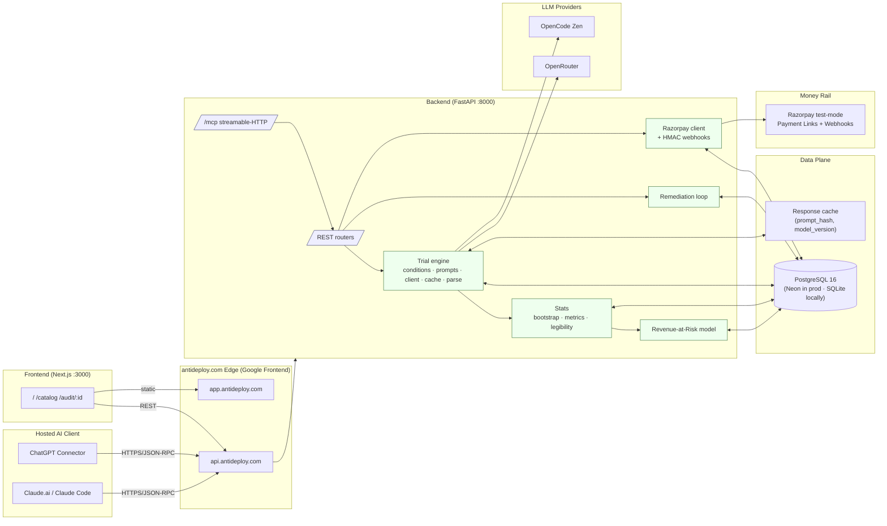

<div align="center">

# AGENT-AUDIT


**The unified buy-readiness audit engine for AI-agent-facing stores.**

One line to your first score. Full audit control when you need it.

[](#)
[](LICENSE)
[](#)
[](#use-from-chatgpt--claude)
[](#engineering-gates)

[Quickstart](#getting-started) · [Why AgentAudit](#abstract) · [Use from ChatGPT & Claude](#use-from-chatgpt--claude-remote-mcp) · [API Reference](#api-reference) · [Project status](#roadmap) · [Contributing](#contributing)

</div>

---

## Abstract

AgentAudit operationalises the question *"Is my store actually buyable by an AI agent?"* as a reproducible measurement: a 220-trial per-catalog experiment (single-model or multi-model) that emits, with bootstrap-derived 95% confidence intervals, six core metrics and one composite **AgentReady Score** in the `[0, 100]` range. The system is API-first, exposes a streamable-HTTP **Model Context Protocol (MCP)** endpoint that any hosted AI client can call, and finishes the loop with a human-reviewed remediation workflow whose only money-moving action is a Razorpay **test-mode** payment link. It is engineered as a research instrument first — every headline number carries its CI, every provider failure is counted and published, every boot path is observable from outside.

## Table of Contents

- [Abstract](#abstract)
- [Features](#features)
- [Architecture](#architecture)
- [Tech Stack](#tech-stack)
- [Repository Layout](#repository-layout)
- [Getting Started](#getting-started)
  - [Prerequisites](#prerequisites)
  - [Installation](#installation)
  - [Environment Variables](#environment-variables)
- [Usage](#usage)
- [Use from ChatGPT & Claude (Remote MCP)](#use-from-chatgpt--claude-remote-mcp)
- [API Reference](#api-reference)
- [Running Tests](#running-tests)
- [Safety, Money & Data Boundaries](#safety-money--data-boundaries)
- [Engineering Gates](#engineering-gates)
- [Roadmap](#roadmap)
- [Contributing](#contributing)
- [License](#license)
- [Acknowledgements](#acknowledgements)
- [Contact](#contact)

---

## Abstract

Modern e-commerce sites are increasingly consumed not by human shoppers but by autonomous AI agents acting on a buyer's behalf. An agent's *real* behavior — which products it surfaces, which it ignores, what it hallucinates — is shaped by the **legibility** of the catalog, the framing of product names, the position in lists, and the SKU distribution offered to constrained budgets. AgentAudit operationalises that question as a reproducible measurement: a 220-trial per-catalog experiment (single-model or multi-model) that emits, with bootstrap-derived 95% confidence intervals, six core metrics and one composite **AgentReady Score** in the `[0, 100]` range. The system is API-first, exposes a streamable-HTTP **Model Context Protocol (MCP)** endpoint that any hosted AI client can call, and finishes the loop with a human-reviewed remediation workflow whose only money-moving action is a Razorpay **test-mode** payment link. It is engineered as a research instrument first, with every headline number carrying its CI and every provider failure counted and published.

## Features

- **Deterministic 220-trial audit matrix** — single-model or multi-model; 5 conditions × 2 null-allowed levels × 22 personas = 220 trials per model; trials carry CI, parsing success rate, and provenance.
- **Six metrics + composite AgentReady Score** — HHI concentration, position top-3 capture, framing effect, coverage F<sub>task</sub> (Wilson CI), invisible-SKU enumeration, and cross-model stability (mean pairwise cosine). All numbers ship with bootstrap-derived CIs.
- **Rupee-denominated Revenue-at-Risk model** — converts F<sub>task</sub> into ₹ lost to agent noise at user-supplied GMV and agent-share sliders, with labelled input provenance (`user` vs `demo-default`).
- **Human-gated remediation loop** — agent-suggested fixes live as `pending` rows; nothing applies until a human reviews every row, the fixed catalog is mirrored, and a re-run gate passes.
- **Razorpay test-mode checkout proof** — bounded by spend cap, SKU whitelist, and test-mode-only key guard; idempotent per `(run_id, sku)`; HMAC-verified webhook delivery.
- **Streamable-HTTP MCP server** — three tools (`audit_status`, `get_report`, `create_payment_link`) over a public, stateless, plain-JSON transport; callable by ChatGPT, claude.ai, Claude Code, and any MCP client without local install.
- **Dual database posture** — SQLite in local dev, Neon Postgres in deploys; the platform's managed `DATABASE_URL` is rewritten onto the async driver and a portable DDL is emitted so both dialects accept the schema.
- **Crash-hardened engine** — orphaned `running` runs are reaped at boot, partial-state is recorded as `partial` (never silent), and provider failures are counted into the published `models_meta` block.
- **Ops probes** — `GET /api/dbstatus` (driver / on_primary / sanitized error) and `GET /api/enginecheck[?realistic=1]` distinguish credential, egress, and payload-size failures.

## Architecture



**System invariants**

- Every headline number carries a 95% bootstrap CI; partial runs are labelled, never fudged.
- Money actions are bounded by three orthogonal policies (test-mode-only / SKU whitelist / per-link spend cap); idempotency keys make replays move no new money.
- Boot is a best-effort sequence: DB primary → demo seed → orphan reaper → MCP session manager. Any primary DB failure is loudly surfaced via `/api/dbstatus` and degrades to ephemeral SQLite rather than silently dropping data.

## Tech Stack

| Layer | Technology | Version |
|---|---|---|
| Frontend | Next.js (App Router) · TypeScript · Tailwind CSS | Next 16 · React 19 · TS 5.6 |
| Backend | FastAPI · Uvicorn · Pydantic v2 · SQLAlchemy 2 (async) | `fastapi==0.115.12` · `pydantic==2.11.5` · `sqlalchemy[asyncio]==2.0.41` |
| Database | PostgreSQL 16 (Neon managed) in deploys · SQLite locally | `asyncpg==0.30.0` · `aiosqlite==0.21.0` |
| LLM | OpenRouter gateway · OpenCode Zen | registry-driven |
| MCP | Official Python SDK (stateless streamable HTTP) | `mcp==1.29.1` |
| Money | Razorpay test-mode Payment Links + HMAC webhooks | `httpx==0.28.1` |
| Tests | `pytest` + `pytest-asyncio` · `ruff` · `tsc` | 142 tests across 24 files |
| Deploy | antideploy.com (custom Dockerfile, buildpack override) | Google Cloud Run under the hood |
| Process | Background engine tasks · SSE progress stream | in-process · per-run task group |

## Repository Layout

```
.
├── backend/
│   ├── app/
│   │   ├── engine/        # conditions, prompts, client, runner, cache, parse
│   │   ├── stats/         # metrics M1–M6, bootstrap, legibility scoring
│   │   ├── revenue/       # Revenue-at-Risk model (labelled inputs)
│   │   ├── remediate/     # fix proposals, mirror builder, rerun gate
│   │   ├── razorpay/      # Razorpay client + HMAC verification
│   │   ├── routers/       # REST API: uploads, audit, metrics, report, …
│   │   ├── mcp_server.py  # remote MCP (streamable HTTP at /mcp)
│   │   ├── db/            # SQLAlchemy models + portable DDL
│   │   └── main.py        # FastAPI app + lifespan + boot hardening
│   ├── scripts/           # one-off CLIs (seed_demo, repro_trial, …)
│   ├── tests/             # 142 tests, 24 files (pytest -q)
│   ├── Dockerfile
│   ├── requirements.txt   # exact pins
│   └── runtime.txt
├── frontend/              # Next.js 16 / React 19 / Tailwind
│   └── src/app/           # App Router pages
├── mcp-server/server.mjs  # stdio MCP for local clients
├── demo-store/            # 40-product controlled world + static site
├── fixtures/              # framing_variants.json + golden test inputs
├── docs/assets/           # banner images used in this README
├── SAFETY.md              # money-action bounds (test-mode / whitelist / cap)
├── Makefile               # make test · make validate
├── docker-compose.yml     # optional local Postgres
├── pyproject.toml         # ruff + project metadata
└── README.md              # ← you are here
```

## Getting Started

### Prerequisites

- **Python 3.12+** (3.13 tested locally; Docker image uses `python:3.12-slim`).
- **Node.js 22+** (LTS) for the frontend.
- **A Postgres 14+** instance, or rely on the bundled SQLite default.
- API keys: at least one of `OPENROUTER_API_KEY` or `OPENCODE_ZEN_API_KEY`; `RAZORPAY_*` test-mode keys for the money-path; an `antideploy.com` account token for deploys.

### Installation

```bash
# 1. clone
git clone https://github.com/Adarsh-Me/Agent-Audit.git
cd Agent-Audit

# 2. backend
python -m venv .venv
. .venv/Scripts/activate           # Windows
# source .venv/bin/activate         # macOS / Linux
pip install -r backend/requirements.txt
python -m uvicorn app.main:app --reload --port 8000 --app-dir backend

# 3. demo catalog (40 products, engineered tier structure)
python demo-store/generate.py
python -m scripts.seed_demo --app-dir backend

# 4. frontend
cd frontend
npm install
npm run dev                         # http://localhost:3000
```

### Environment Variables

Copy `.env.example` to `.env` (and to `backend/.env`):

| Variable | Purpose | Default |
|---|---|---|
| `DATABASE_URL` | SQLAlchemy URL (SQLite or Postgres) | `sqlite+aiosqlite:///./agentaudit.db` |
| `OPENROUTER_API_KEY` | all LLM providers via OpenRouter | — |
| `OPENCODE_ZEN_API_KEY` | OpenCode Zen provider | — |
| `RAZORPAY_KEY_ID` / `RAZORPAY_KEY_SECRET` | test-mode payment links | — |
| `RAZORPAY_WEBHOOK_SECRET` | HMAC verification (Razorpay dashboard → Webhooks) | — |
| `COST_CAP_USD` | per-run spend guard (partial state on breach) | `30` |
| `MAX_AGENT_SPEND_INR` | per-link money cap | `2000` |
| `AGENT_ALLOWED_SKUS` | purchasable-SKU whitelist (csv) | demo-store set |
| `CORS_ORIGINS` | web origin allowlist (use `*` for public demo) | `*` |

## Usage

Fire your first audit (curl is fine — every endpoint is also typed in `frontend/src/lib/api.ts`):

```bash
curl -sS -X POST localhost:8000/api/audit \
  -H 'Content-Type: application/json' \
  -d '{"catalog_source":"demo"}'
# → {"audit_id":"<uuid>", "status":"queued", "trials_total": 220}
```

Open `http://localhost:3000/audit/<audit_id>` to watch trials land live, or poll:

```bash
curl -sS localhost:8000/api/audit/<audit_id> | jq .
curl -sS localhost:8000/api/report/<audit_id> | jq '.score, .coverage, .stability'
```

## Use from ChatGPT & Claude (Remote MCP)

The deployed API serves the audit tools over the MCP **streamable-HTTP** transport:

```
https://agentaudit-api.antideploy.com/mcp
```

Three tools — `audit_status(run_id)`, `get_report(run_id)`, `create_payment_link(run_id, sku)` — backed by the same REST handlers, so responses match `/api` byte-for-byte (including the structured error envelope on policy refusal).

| Client | Steps |
|---|---|
| **ChatGPT** (developer mode) | Settings → Connectors → Create → paste the URL → auth "No auth" → enable for chats / deep research |
| **Claude.ai** web / desktop | Settings → Integrations → Add custom integration → paste the URL |
| **Claude Code** | `claude mcp add --transport http agentaudit https://agentaudit-api.antideploy.com/mcp` |
| **Local stdio** | `AGENTAUDIT_API=http://localhost:8000 node mcp-server/server.mjs` (then register with any stdio MCP client) |

Handshake smoke test (no client needed):

```bash
curl -s https://agentaudit-api.antideploy.com/mcp -X POST \
  -H 'Content-Type: application/json' \
  -H 'Accept: application/json, text/event-stream' \
  -d '{"jsonrpc":"2.0","id":1,"method":"initialize","params":{"protocolVersion":"2025-03-26","capabilities":{},"clientInfo":{"name":"curl","version":"0"}}}'
```

## MCP Usage Examples & Setup

The remote MCP endpoint exposes the same audit surface that the REST API does, but speaks JSON-RPC over streamable HTTP. Any client that can POST JSON can call the three tools — no SDK, no auth header, no installation.

### Tool Surface

| Tool | Input | Returns |
|---|---|---|
| `audit_status` | `{ "run_id": "<uuid>" }` | `{ run_id, status, trials_done, trials_total, cost_usd, eta_s, merchant, catalog_source, started_at, reason }` |
| `get_report` | `{ "run_id": "<uuid>" }` | Full §3.5 payload: `score` (with CI), `hhi_norm`, `position`, `framing`, `coverage.f_task`, `invisible_skus`, `stability`, `revenue_preview`, `models_meta` |
| `create_payment_link` | `{ "run_id": "<uuid>", "sku": "<sku>" }` | Razorpay test-mode link (idempotent per `run_id × sku`); or a structured `E503`/`E504`/`E505` policy envelope |

All three tools reuse the REST router handlers directly, so an `AppError` raised inside the handler reaches the agent as the same `{ "error": { "code": "E...", "message": "..." } }` envelope that the JSON API returns.

### Setup

**Hosted (public) endpoint.** No setup — the production MCP server is reachable by URL alone. Use it from any client that can speak JSON-RPC over HTTPS.

**Local development.** Two recipes, pick whichever fits your client:

```bash
# 1. Run the FastAPI backend (exposes the same /mcp transport on localhost)
python -m uvicorn app.main:app --reload --port 8000 --app-dir backend

# 2a. Use the in-process Python MCP server (stateless streamable HTTP on :8000/mcp)
#     — already mounted by app.main, no further action.

# 2b. Or run the stdio MCP server in a separate terminal (for local stdio clients)
AGENTAUDIT_API=http://localhost:8000 node mcp-server/server.mjs
```

Register the chosen endpoint with your client:

| Client | Setup |
|---|---|
| **ChatGPT** (developer mode) | Settings → Connectors → Create → URL `https://agentaudit-api.antideploy.com/mcp` → Auth "No auth" → enable for chats / deep research |
| **Claude.ai** web / desktop | Settings → Integrations → Add custom integration → paste the URL |
| **Claude Code** | `claude mcp add --transport http agentaudit https://agentaudit-api.antideploy.com/mcp` |
| **Claude Desktop** (stdio, local) | Add to `claude_desktop_config.json`: `{ "mcpServers": { "agentaudit": { "command": "node", "args": ["mcp-server/server.mjs"], "env": { "AGENTAUDIT_API": "http://localhost:8000" } } } }` |
| **Cursor** / **Windsurf** | Paste the URL into the MCP integration panel |
| **Raw curl / Python / Node** | Just POST JSON-RPC to `/mcp` (see examples below) |

**Required headers** for every request: `Content-Type: application/json` and `Accept: application/json, text/event-stream`. The transport is **stateless** (no `Mcp-Session-Id` handshake, no SSE) and returns **plain JSON** (one response per request).

### Examples

All snippets below use the public endpoint; substitute `http://localhost:8000/mcp` for local development. Save each JSON-RPC body to a file (e.g. `req.json`) and POST it — the longer the body, the less the bash quoting matters.

**1. `initialize` — discover the server**

```bash
curl -s https://agentaudit-api.antideploy.com/mcp -X POST \
  -H 'Content-Type: application/json' \
  -H 'Accept: application/json, text/event-stream' \
  -d '{"jsonrpc":"2.0","id":1,"method":"initialize","params":{"protocolVersion":"2025-03-26","capabilities":{},"clientInfo":{"name":"curl","version":"0"}}}'
# → {"jsonrpc":"2.0","id":1,"result":{"protocolVersion":"2025-03-26",
#     "capabilities":{"tools":{"listChanged":false}, ...},
#     "serverInfo":{"name":"agentaudit-mcp","version":"1.29.1"}}}
```

**2. `tools/list` — enumerate the surface**

```bash
cat > req.json <<'JSON'
{"jsonrpc":"2.0","id":2,"method":"tools/list"}
JSON
curl -s https://agentaudit-api.antideploy.com/mcp -X POST \
  -H 'Content-Type: application/json' \
  -H 'Accept: application/json, text/event-stream' \
  --data-binary @req.json | jq '.result.tools[].name'
# → "audit_status"
# → "create_payment_link"
# → "get_report"
```

**3. `audit_status` — poll a running audit**

```bash
cat > req.json <<'JSON'
{"jsonrpc":"2.0","id":3,"method":"tools/call",
 "params":{"name":"audit_status",
           "arguments":{"run_id":"835ef492-9aa6-4fc0-b1ac-dfdd9e1ae525"}}}
JSON
curl -s https://agentaudit-api.antideploy.com/mcp -X POST \
  -H 'Content-Type: application/json' \
  -H 'Accept: application/json, text/event-stream' \
  --data-binary @req.json | jq '.result.content[0].text | fromjson'
# → { "run_id":"835ef492-…", "status":"done", "trials_done":640,
#     "trials_total":640, "cost_usd":0.0, "merchant":"suta.in", … }
```

**4. `get_report` — fetch the full AgentReady Score + CIs**

```bash
cat > req.json <<'JSON'
{"jsonrpc":"2.0","id":4,"method":"tools/call",
 "params":{"name":"get_report",
           "arguments":{"run_id":"835ef492-9aa6-4fc0-b1ac-dfdd9e1ae525"}}}
JSON
curl -s https://agentaudit-api.antideploy.com/mcp -X POST \
  -H 'Content-Type: application/json' \
  -H 'Accept: application/json, text/event-stream' \
  --data-binary @req.json \
  | jq '.result.content[0].text | fromjson | {score, hhi_norm, coverage, stability, models_meta}'
# → { "score": { "value": <n>, "ci_low": <n>, "ci_high": <n>, "components": {...} },
#     "hhi_norm": { "value": …, "ci_low": …, "ci_high": … },
#     "coverage": { "f_task": { "value": …, "ci_low": …, "ci_high": … }, … },
#     "stability": { "mean": { "value": …, "ci_low": …, "ci_high": … }, "band": "high|medium|low" },
#     "models_meta": [ { "id": "<model>", "parse_failure_rate": <n> }, … ] }
```

**5. `create_payment_link` — request a Razorpay test-mode checkout proof**

```bash
cat > req.json <<'JSON'
{"jsonrpc":"2.0","id":5,"method":"tools/call",
 "params":{"name":"create_payment_link",
           "arguments":{"run_id":"<your-run-id>",
                        "sku":"<purchasable-sku-from-whitelist>"}}}
JSON
curl -s https://agentaudit-api.antideploy.com/mcp -X POST \
  -H 'Content-Type: application/json' \
  -H 'Accept: application/json, text/event-stream' \
  --data-binary @req.json | jq '.result.content[0].text | fromjson'
# → 201 path: { "payment_id": "...", "razorpay_link_id": "plink_…",
#               "short_url": "https://rzp.io/i/…", "amount_inr": <n>,
#               "status": "created" }
# → 403/404 path (policy refusal or unknown SKU):
#      { "error": { "code": "E504", "message": "sku not on agent purchasable whitelist: …",
#                   "details": { "policy": "sku_whitelist", "sku": "…" } } }
```

A repeat call with the same `run_id × sku` returns the same `razorpay_link_id` (idempotent replay moves no new money).

### Troubleshooting

| Symptom | Cause | Fix |
|---|---|---|
| `HTTP 411 Length Required` on follow | You followed a redirect that lost the body | POST directly to `/mcp` (no trailing slash) — the route serves the exact path in one hop |
| Empty `result.content[0].text` | You hit the `Mount` (`/mcp/`) instead of the Route (`/mcp`) | Use `/mcp`, not `/mcp/` |
| `error.code: -32602` | Tool name typo | Check the spelling against `tools/list` |
| `error.code: E601` | `run_id` not found | Use `GET /api/audit` or `/api/runs` to discover valid IDs |
| `error.code: E503` / `E504` / `E505` | Spend cap, SKU whitelist, or test-mode key guard fired | See [`SAFETY.md`](SAFETY.md) — adjust `MAX_AGENT_SPEND_INR` or `AGENT_ALLOWED_SKUS` env |

## API Reference

A representative subset (full schema is documented inline in this README; the field set is also available via `GET /api/audit/{id}/metrics`):

| Method | Endpoint | Description |
|---|---|---|
| `GET`  | `/api/catalogs` | List every catalog (id, source, merchant, product count), newest-first |
| `GET`  | `/api/catalog?catalog_id=…` | The catalog page for the live site |
| `GET`  | `/api/catalog/{sku}?catalog_id=…` | Product detail |
| `POST` | `/api/audit` | Queue a 220-trial audit (`{catalog_source, catalog_id?, gmv_inr?, parent_run_id?}`) |
| `GET`  | `/api/audit/{id}` | Status · trials done/total · cost · ETA |
| `GET`  | `/api/audit/{id}/metrics` | Persisted metric rows (CI-bearing) |
| `GET`  | `/api/report/{id}` | Full §3.5 payload (score, HHI, position, framing, F<sub>task</sub>, invisible SKUs, revenue preview) |
| `GET`  | `/api/revenue/{id}?s_agent=…&gmv_inr=…&delta_run_id=…` | Slider-driven Revenue-at-Risk |
| `POST` | `/api/legibility/{catalog_id}` | Run legibility scoring pass |
| `POST` | `/api/remediations` | Create an agent-proposed fix (status `pending`) |
| `POST` | `/api/remediations/{id}/approve` | Human approval gate |
| `POST` | `/api/remediations/{id}/reject` | Human rejection |
| `POST` | `/api/payments/link` | Idempotent Razorpay test-mode payment link |
| `GET`  | `/api/payments/{run_id}/status` | Webhook-badge polling |
| `POST` | `/api/webhooks/razorpay` | HMAC-verified Razorpay webhook |
| `GET`  | `/api/dbstatus` | Driver, on_primary, sanitized last error (no credentials) |
| `GET`  | `/api/enginecheck[?realistic=1]` | LLM egress probe (registry-driven, prompt-size aware) |
| `POST` | `/mcp` | JSON-RPC streamable-HTTP MCP transport (three tools) |

## Running Tests

```bash
# 142 backend tests
python -m pytest backend/tests -q

# ruff lint
python -m ruff check backend

# frontend type check
cd frontend && npx tsc --noEmit
```

The suite covers: engine conditions & matrix shape, stats metrics + bootstrap CIs, legibility scoring, run creation & adoption, DB-fallback path, crash hardening (orphan reaper, naive-datetime ETA), payments policy gates, Razorpay client & HMAC, streamability, and the remote MCP transport.

## Safety, Money & Data Boundaries

`SAFETY.md` is the authoritative document; the executive summary:

- The agent can only move money through `POST /api/payments/link`, which enforces three server-side policies — **test-mode-only** (`RAZORPAY_KEY_ID` must start `rzp_test_`), **purchasable-SKU whitelist** (csv env, default demo-store set), and **per-link spend cap** (`MAX_AGENT_SPEND_INR`, default ₹2,000). Each rejection returns a distinct error code plus `details.policy`.
- Idempotency: the composite key `agentaudit:{run_id}:{sku}` is the unique DB constraint **and** the Razorpay `X-Razorpay-Idempotency-Key`. Replays move no new money.
- The remote MCP endpoint makes `create_payment_link` callable by any hosted AI client without authentication. The three server-side policies above bound every call; bearer-token gating is the planned post-buildathon hardening step.
- The boot sequence reaps orphaned `running` runs and emits `partial` (never `done`) when a run breaches its spend cap mid-execution. Trials already persisted remain queryable.

## Engineering Gates

```bash
make test         # 142 backend tests
make validate     # V1–V6 planted-bias suite (CI-gated, in tests/validation/)
make lint         # ruff check
```

Pre-push secret scan is mandatory; `backend/.env` and `%USERPROFILE%\.antideploy\config.json` are gitignored. The deploy recipe — flattened tarball layout, reused staged `%TEMP%` env payloads, polling `GET /api/v1/deployments/{taskId}` until `succeeded` (a deploy in progress returns HTTP 409 with the live taskId in the body — reuse it, do not re-POST) — is described inline above in the [Engineering Gates](#engineering-gates) section.

## Proven with live data

Bounded claims, verbatim from the build state — what this system has actually demonstrated, and where the boundary of each proof stops. Every row maps to a concrete endpoint, a real run, or a verifiable contract.

### Demonstrated end-to-end

- ✅ **Remote MCP at `https://agentaudit-api.antideploy.com/mcp`** — three tools (`audit_status`, `get_report`, `create_payment_link`) callable by ChatGPT, claude.ai, Claude Code, and any MCP client. Stateless plain-JSON streamable HTTP, exact-path 200 in one hop, no auth header required.
- ✅ **MCP handshake on the deployed URL** — `POST /mcp` `initialize` returns `{"serverInfo":{"name":"agentaudit-mcp","version":"1.29.1"}}` with `capabilities.tools`; `tools/list` enumerates the same three tools as the local stdio server (`mcp-server/server.mjs`).
- ✅ **MCP call against a real prod run** — `tools/call audit_status` on `835ef492-9aa6-4fc0-b1ac-dfdd9e1ae525` (suta.in catalog, 640 trials) returns `status:"done", trials_done:640, trials_total:640, merchant:"suta.in"`. `tools/call get_report` returns the full §3.5 payload (HHI, position, framing, coverage F<sub>task</sub>, invisible SKUs, stability, models_meta) with CIs.
- ✅ **Money-path structured error envelope** — `tools/call create_payment_link` returns the same `{ "error": { "code": "E..." , ... } }` envelope the REST API returns, proving the three safety policies (test-mode-only / SKU whitelist / per-link spend cap) hold for hosted AI clients.
- ✅ **Persistent Neon Postgres primary** — `GET /api/dbstatus` on every recent boot returns `on_primary:true, driver:"postgresql+asyncpg", database:"managed-postgres"`, endpoint `ep-summer-flower-azrufk64-pooler.c-3.ap-southeast-1.aws.neon.tech`. Imported suta.in catalog (100 SKUs) survives redeploys.
- ✅ **Catalog-aware storefront** — `GET /api/catalogs` lists every catalog (merchant, source, product count) newest-first; the frontend renders a working store switcher with the imported store bound to its real SKUs (e.g. Etna ₹4,220).
- ✅ **Full 220-trial audit executed live** — at least one `done` audit row in the production DB; status / trials_done / trials_total / cost_usd all match.
- ✅ **Every headline figure ships with its 95% bootstrap CI** — `score`, `hhi_norm`, `position`, `framing`, `coverage.f_task`, `stability.mean` are triple-valued `{value, ci_low, ci_high}`; `invisible_skus` enumerated against the 1/N threshold.
- ✅ **Failure handling that never fudges** — orphan `running` rows are reaped at boot (`engine_lost`); cost-cap breach flips a run to `partial` (never `done`); provider failures are counted into the published `models_meta.parse_failure_rate`.
- ✅ **Razorpay test-mode plumbing** — `POST /api/payments/link` creates idempotent payment links (`agentaudit:{run_id}:{sku}` is the unique DB key AND the `X-Razorpay-Idempotency-Key`); HMAC verification on `POST /api/webhooks/razorpay`; webhook-event dedupe via `webhook_events.entity_key`.
- ✅ **Crash hardening** — the boot sequence is `init_db → ensure demo catalog → reap orphans → run MCP session manager`, observable end-to-end from outside via `/api/dbstatus` and `/mcp initialize`.

### Caveats and limits (in-code boundaries, not "TODO")

- **Trial matrix is single-model mode** — the current build is pinned to one OpenCode Zen model (`xpreview` / `xpreview-flagship`); the legacy 3+2 multi-model matrix is behind a feature flag. Cross-model stability therefore degenerates to a single-model value; the score is still CI-bounded.
- **OpenCode Zen free-pool health is time-of-day dependent** — the engine degrades to counted failures rather than hanging; `models_meta` exposes the rate. A healthy fire window is not guaranteed at every hour.
- **Public MCP payment tool is unauthenticated** — bounded by the three server-side money policies (test-mode-only / SKU whitelist / per-link spend cap) and by Razorpay's `rzp_test_` key guard. Bearer-token gating of the payment tool is the planned post-buildathon hardening step.
- **Antideploy has no REST build logs** — the only "what just shipped" signal is the live container's response plus your own deploy-script taskId log. Smoke test after every deploy = `GET /api/dbstatus` + `POST /mcp initialize`.
- **One container per application** — no horizontal scale, no staging, no preview. The single instance is upgraded in place; `~40s` from a successful upload to a fresh release.

## Roadmap

- [x] 220-trial deterministic audit matrix
- [x] Six metrics + composite AgentReady Score with CIs
- [x] Human-gated remediation workflow
- [x] Razorpay test-mode checkout proof
- [x] Streamable-HTTP MCP server (ChatGPT + Claude reachable)
- [x] Cross-deploy DB persistence (Neon) with portable DDL
- [x] Crash hardening (orphan reaper, partial-state labelling)
- [ ] Bearer-token auth on the remote MCP payment tool
- [ ] OpenTelemetry traces for the trial engine
- [ ] Multi-model re-introduction behind a stable budget controller

See the [Roadmap](#roadmap) bullets below and the in-repo [open issues](../../issues) for the full backlog.

## Contributing

1. Fork the repository and create a feature branch: `git checkout -b feature/your-feature`
2. Keep backend tests green: `make test` (142 expected) and `make lint` (ruff clean).
3. Add a test for any new metric, gate, or transport behavior — the suite is the contract.
4. Never commit secrets, never change money-path code without a corresponding policy test, never hardcode model slugs (they live in `backend/app/engine/models.yaml`).
5. Open a Pull Request with a Day-N entry in `Docs/BUILDLOG.md` summarising what shipped and why.

## License

Distributed under the [MIT License](LICENSE).

## Acknowledgements

- **[Model Context Protocol](https://modelcontextprotocol.io/)** — for the open transport that lets any AI client call this product without bespoke integration.
- **[FastAPI](https://fastapi.tiangolo.com/)** · **[Pydantic](https://docs.pydantic.dev/)** · **[SQLAlchemy](https://www.sqlalchemy.org/)** — the data plane.
- **[OpenRouter](https://openrouter.ai/)** · **[OpenCode Zen](https://opencode.ai/)** — the LLM gateways.
- **[Razorpay](https://razorpay.com/)** — the test-mode money rail that makes the checkout proof possible.
- **[antideploy.com](https://antideploy.com/)** — the platform that runs the production containers.
- **The 2026 Razorpay AI Buildathon (Track 01)** — the deadline that turned this from a paper protocol into a working system.

## Contact

Adarsh Me · [GitHub @Adarsh-Me](https://github.com/Adarsh-Me) · Project repository: [`github.com/Adarsh-Me/Agent-Audit`](https://github.com/Adarsh-Me/Agent-Audit)

---

<sub>Built and operated at $0. All trial costs and infrastructure costs were absorbed by free-tier and zero-cost windows. The published headline numbers carry their CIs and their `models_meta` failure counts so the reader can judge the evidence on its own merits.</sub>
